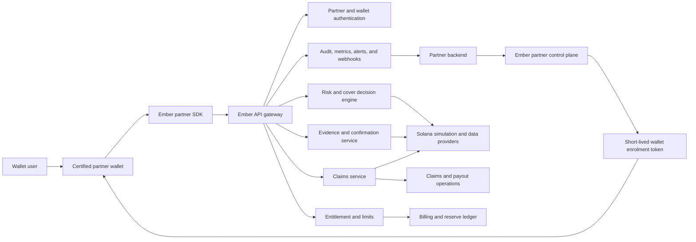

# EmberCover Mainnet Production Programme

**Status:** Proposed production programme  
**Date:** 2026-07-26  
**Scope:** Ember API, partner SDK, claims service, production operations, and the Ember Chrome reference wallet  
**Primary repositories:** `ember` and `ember-cover-wallet`

## 1. Purpose

This document is the master plan for taking EmberCover from its current Devnet
implementation to a working, supportable mainnet product.

It records:

- the commercial product boundary;
- the target partner integration architecture;
- the work required across the API, partner SDK, claims service, reference
  wallet, Solana infrastructure, security, legal, finance, and operations;
- dependencies and ownership;
- mainnet launch phases;
- hard release gates and the evidence required to pass them.

This is a programme plan, not the final insurance contract, API specification,
or technical design. Those documents are required outputs of the programme.

Sections 26 onward provide the detailed implementation playbook: repository
boundaries, branch order, type-driven contracts, illustrative code, test-driven
delivery, migrations, QA checkpoints, and release evidence. Code blocks in this
document are design examples, not patches ready to merge unchanged.

No public mainnet launch date should be committed until the hard gates in this
document have named owners and approved evidence.

## 2. Product Positioning Decision

The following direction is accepted:

> The Ember Chrome wallet is Ember's reference and partner-certification wallet.
> The commercial product is the Ember API, partner SDK, and claims service.

### 2.1 Commercial product

Ember sells and operates:

1. A hosted, multi-tenant cover-decision and evidence API.
2. A partner SDK for wallet integration.
3. Wallet enrolment and entitlement services.
4. A claims intake, review, decision, and payout service.
5. Partner onboarding, certification, reporting, support, and operational
   controls.

### 2.2 Reference wallet

The Chrome wallet exists to:

- prove the full Ember integration;
- provide a canonical example for partner engineers;
- exercise both supported Wallet Standard transaction lifecycles;
- test new policy, API, SDK, and claims releases;
- support partner certification and internal mainnet validation;
- demonstrate the expected user experience.

It is not the primary consumer wallet business and must not cause Ember to spend
most of its product effort rebuilding the account, swap, staking, hardware
wallet, fiat, and recovery features of established wallets.

If the reference wallet is publicly distributed and permitted to hold material
mainnet funds, it must still meet the wallet safety requirements in this plan.
Calling it a reference wallet does not remove the duty to protect users.

## 3. Definition of a Working Production Product

EmberCover is working in production only when all of the following are true:

1. A partner can be approved, configured, issued credentials, and certified
   without a custom deployment or manual database edit.
2. A partner's secret API key remains on its server and is never shipped in a
   browser extension, mobile application, or downloadable wallet.
3. A wallet user can be enrolled through a signed challenge and linked to a
   valid partner entitlement.
4. The wallet can request a decision for the exact mainnet transaction before
   signing.
5. The decision is bound to the wallet, partner, transaction bytes, cluster,
   policy version, terms version, entitlement, cap, and expiry.
6. Signing remains available when Ember is unavailable, while cover fails
   closed and is clearly shown as unavailable.
7. Signed and landed evidence is attached durably, even if the wallet closes,
   the dapp broadcasts, or an RPC provider temporarily fails.
8. Ember independently verifies the confirmed mainnet transaction rather than
   trusting a client callback.
9. A user can see the authoritative status of a covered transaction and submit
   a claim.
10. Claims staff can review, request information, approve, reject, escalate,
    pay, and reconcile a claim through controlled tooling.
11. Every cover promise is tied to enforceable terms that the user accepted.
12. Cover exposure is bounded by funded reserves, policy limits, partner limits,
    product limits, and a tested kill switch.
13. Production has monitoring, alerting, backups, incident response, support,
    audit logs, privacy controls, and a staffed operating model.
14. Legal, insurance, compliance, security, financial, and technical launch
    gates have documented approval.

## 4. Mainnet Does Not Mean Immediate Unrestricted Liability

Moving to mainnet should be treated as a controlled production progression:

1. Mainnet shadow validation using real transaction state but no cover promise.
2. Internal mainnet validation with tightly limited wallets and funds.
3. Controlled live cover with approved partners and strict aggregate exposure.
4. Wider production availability after operational and claims evidence exists.

The final two steps are real production: real mainnet transactions, real
entitlements, real cover decisions, and a funded obligation to pay valid claims.
The earlier steps prove that Ember can safely make that promise.

## 5. Decisions That Must Be Locked Before Liability Is Enabled

These decisions cannot be left to implementation teams or inferred from older
documents.

### 5.1 Legal and regulatory structure

Specialist insurance and regulatory counsel must approve:

- the legal entity providing the product;
- whether the product is insurance, a warranty, indemnity, guarantee, or another
  regulated cover arrangement;
- launch jurisdictions and excluded jurisdictions;
- licensing, underwriting, distribution, and intermediary requirements;
- who legally carries the claim liability;
- required capital, reserves, reporting, and complaints procedures;
- KYC, AML, sanctions, fraud, and payout-screening obligations;
- required consumer and partner disclosures;
- use of the words `cover`, `protected`, `insured`, and `guaranteed`.

**Gate:** No real cover promise or collection of production premiums until
written advice, approved terms, and responsibility for claims funding exist.

### 5.2 Commercial model

One primary partner billing model must be selected for initial production:

- partner pays per active covered user;
- partner prepays for a bundle of covered users;
- partner funds a defined aggregate cover capacity;
- Ember bills each end user and shares revenue with the partner;
- a documented hybrid.

**Recommended starting direction:** partner-funded entitlements with explicit
per-user and per-partner aggregate exposure limits. Keep the direct one-off
payment flow as a reference/testing path until the direct-to-consumer legal and
support model is approved.

The selected model must define:

- price and billing period;
- payment currency and settlement process;
- renewal, expiry, grace, cancellation, and refund rules;
- partner invoice or on-chain payment reconciliation;
- partner revenue share, if any;
- what happens to existing cover if the partner does not renew;
- maximum Ember liability per user, partner, month, incident, and product.

### 5.3 Initial Production Coverage Contract

The current documents conflict on transaction value, NFTs, Token-2022, partner
billing, and the breadth of covered programs. A single approved coverage
contract must replace those assumptions.

It must define:

- insured event and qualifying loss;
- immediate-loss and delegated-loss rules;
- supported transaction classes;
- supported assets and mints;
- supported and excluded Solana programs;
- versioned transaction and address lookup table behaviour;
- Token Program and Token-2022 treatment;
- NFT and compressed NFT treatment;
- maximum payout and aggregate limits;
- valuation time and data sources;
- decision lifetime;
- delegate tail window;
- claim filing window;
- evidence requirements;
- exclusions, deductibles, waiting periods, and fraud provisions;
- treatment of protocol exploits, compromised private keys, social engineering,
  oracle manipulation, lost devices, and unsupported transactions.

**Recommended initial mainnet scope for approval:**

- Solana mainnet only;
- integrations certified at Ember Level 3;
- SOL and an explicit mint allowlist beginning with canonical mainnet USDC;
- known transaction classes and allowlisted programs that Ember can decode,
  simulate, value, and verify end to end;
- unknown asset-moving programs are unsupported;
- Token-2022 extensions are supported only after extension-specific
  certification, rather than automatically covered at a high-risk band;
- NFTs and compressed NFTs are excluded until an independently defensible
  valuation and ownership-evidence system is operating;
- protocol exploits, oracle manipulation, and losses without an exact causal
  evidence chain remain excluded;
- conservative per-transaction, per-user, per-partner, per-incident, and global
  exposure limits.

This is a constrained but complete production contract. Scope can expand through
versioned policy releases after evidence, reserves, and pricing support it.

### 5.4 Claims and payout policy

Approve:

- claim filing and evidence deadlines;
- decision and appeal states;
- target response and resolution times;
- when additional evidence can be requested;
- fraud holds and escalation rules;
- payout currency and destination requirements;
- valuation methodology;
- partial payout and deductible rules;
- duplicate-loss and shared-incident treatment;
- who can approve payments at each value threshold;
- customer and partner communications;
- complaint and appeal procedures.

### 5.5 Production service levels

Approve measurable targets for:

- API availability;
- pre-sign response latency;
- error rate;
- evidence-sealing delay;
- claim response and resolution;
- partner support;
- recovery point and recovery time;
- RPC failover;
- incident notification.

The existing integration target of API processing p95 below 500 milliseconds
and a wallet-side pre-sign timeout of 1,500 milliseconds should be retained or
formally changed.

## 6. Target Partner Architecture

No partner-specific Cloudflare Worker should be required.



### 6.1 Partner secret flow

1. Ember approves a partner and creates separate integration and production
   tenants.
2. The partner receives a secret API key through a secure control plane.
3. The key is stored only by the partner backend.
4. The backend uses the key to create or update user entitlements and request a
   short-lived wallet-enrolment token.
5. The wallet signs an Ember challenge proving control of the public key.
6. Ember binds the wallet, partner, user reference, entitlement, cluster, and
   permitted scopes.
7. Ember issues a short-lived wallet credential or accepts tightly specified
   wallet-signed requests.
8. The wallet calls pre-sign, post-sign, status, and claim-intake endpoints
   without possessing the partner secret.

### 6.2 Partners without a backend

If Ember chooses to support wallets with no backend, provide an Ember-hosted
public-client enrolment service. It must use:

- a registered public client ID, not a secret;
- signed wallet challenges;
- approved redirect or application origins;
- short-lived, scoped tokens;
- rate limits and device/session controls;
- partner configuration held by Ember.

The fallback must not be a permanent secret embedded in the wallet.

### 6.3 Authentication domains

Keep these identities separate:

- **Partner server identity:** API key or stronger server credential.
- **Wallet identity:** proof of private-key control.
- **Wallet session identity:** short-lived, revocable operational credential.
- **End-user/claimant identity:** partner reference plus any legally required
  claimant verification.
- **Staff identity:** SSO-backed role and MFA.
- **System identity:** service-to-service workload credentials.

Every audit entry must record the identity domain, actor, tenant, action, target,
reason, request ID, and time.

## 7. Workstream A: Product, Legal, Risk, and Commercial

### Deliverables

- One authoritative Product and Coverage Contract.
- Approved legal structure and launch geography.
- Versioned terms, exclusions, privacy notice, claim policy, and complaints
  policy.
- Partner commercial agreement, SLA, data-processing terms, branding rules, and
  integration responsibilities.
- Pricing and aggregate exposure model.
- Reserve and reinsurance/underwriting position, where applicable.
- Incident-level aggregation rules.
- Product change and policy-version approval process.
- Two-person approval, staged rollout, shadow comparison, and rollback for
  policy changes that can increase liability.
- User-facing wording for every decision and claim state.

### Required controls

- Terms cannot be changed retroactively for an existing decision.
- Every decision stores the accepted terms and policy versions.
- Every entitlement has an effective period and funding source.
- Every cap has a defined unit, reset period, and concurrency-safe enforcement
  point.
- Marketing claims cannot exceed the legal coverage contract.

### Exit criteria

- Product, legal, risk, finance, and claims owners sign the same contract.
- No unresolved contradiction remains between the PRD, underwriting
  specification, payment model, API contract, and terms.
- Maximum possible liability is calculable from production data.

## 8. Workstream B: Partner Control Plane and API Product

### 8.1 Partner lifecycle

Build supported operations for:

- partner application and approval;
- integration and production tenants;
- partner status, suspension, and termination;
- allowed origins, applications, signing methods, clusters, and products;
- API credential issue, list, last-used reporting, rotation, overlap, and
  revocation;
- partner members and roles;
- partner exposure, rate, and feature configuration;
- certification status and permitted Ember branding;
- partner billing and settlement state;
- partner audit history.

No production operation should require directly editing a database row.

### 8.2 Wallet and user enrolment

Provide:

- server-created short-lived enrolment intent;
- nonce generation with expiry and one-time use;
- standard Solana off-chain message;
- wallet signature verification;
- partner and entitlement binding;
- wallet unlinking and re-enrolment;
- lost-device and changed-wallet handling;
- session issue, renewal, expiry, rotation, and revocation;
- protection from replay and cross-partner token reuse;
- a user-facing record of which partner enrolled the wallet.

### 8.3 Entitlements and limits

Support:

- partner-funded and, if approved, direct-user-funded entitlements;
- explicit effective and expiry times;
- renewal and lapse;
- user, wallet, partner, product, incident, and global caps;
- atomic count and loss usage;
- immutable entitlement snapshot in the decision record;
- suspension without destroying historical evidence;
- reconciliation between payment, contract, entitlement, and cover periods.

### 8.4 API contract

The commercial API needs:

- a versioned OpenAPI contract;
- published schemas and generated/reference types;
- consistent errors and reason codes;
- request IDs and distributed trace IDs;
- idempotency behaviour for every retriable write;
- pagination, filtering, and stable cursors;
- documented timeouts, retries, and rate limits;
- request and decompression size limits;
- strict content-type and payload validation;
- tenant isolation tests and access-control enforcement;
- exact CORS/origin policy where browser access is supported, without treating
  CORS or origin headers as authentication;
- environment and cluster discovery;
- partner capability and policy discovery;
- status and incident communication;
- deprecation and compatibility policy;
- changelog and migration guides.

### 8.5 Required API surfaces

The final route design may differ, but the product must cover:

- partners and partner credentials;
- partner users and entitlements;
- wallet enrolment and session management;
- pre-sign decision;
- post-sign evidence;
- decision and evidence status;
- covered-transaction history;
- payment or contract activation;
- claim create, list, detail, evidence, status, and appeal;
- staff claim review, hold, approve, reject, and request-information;
- payout authorise, verify, record, and reconcile;
- webhooks and delivery history;
- policy, terms, capabilities, and service status.

### 8.6 Decision integrity

Every decision must be bound to:

- partner and integration version;
- user reference and wallet;
- mainnet cluster identity;
- authenticated wallet/application source and independently derived browser
  origin or native application identity where available;
- raw transaction/message hash;
- signers and fee payer;
- policy and terms versions;
- entitlement and cap snapshot;
- simulation and context hashes;
- issue and expiry time;
- decision status, risk band, confidence, and reason codes.

Signed Ember responses should be evaluated for production so a wallet, claimant,
partner, or auditor can later prove what Ember decided.

### Exit criteria

- A new partner can complete onboarding and certification without a custom
  Worker, shared demo credential, or manual database mutation.
- A leaked or revoked partner credential cannot be used from a downloadable
  wallet.
- API conformance, compatibility, rate-limit, and idempotency tests pass.

## 9. Workstream C: Partner SDK and Developer Product

### 9.1 SDK responsibilities

The partner SDK should provide:

- environment and cluster-safe configuration;
- enrolment and wallet-session support;
- pre-sign and post-sign clients;
- status and authoritative activity clients;
- claim-intake and claim-status clients;
- typed decisions, evidence states, errors, and reason codes;
- timeout, retry, cancellation, and idempotency handling;
- safe telemetry hooks without private-key or seed access;
- adapters that contain any legacy Solana type conversions at the boundary.

### 9.2 Signing lifecycles

Publish separate, complete integrations for:

#### `signTransaction`

1. Receive the exact transaction and chain from the dapp.
2. Start pre-sign review while rendering the normal approval screen.
3. Display Ember's result before approval.
4. Sign the exact reviewed bytes.
5. Persist post-sign work before returning the signed transaction.
6. Send signed bytes/signature to Ember.
7. Allow the dapp to broadcast.
8. Let Ember independently locate, verify, and seal the landed transaction.

#### `signAndSendTransaction`

1. Receive and validate the exact transaction and chain.
2. Complete pre-sign review.
3. Display Ember's result.
4. Sign and broadcast using the wallet's normal path.
5. Persist and submit post-sign evidence.
6. Track confirmation and expose the signature/status to the wallet UI.
7. Let Ember independently verify and seal the transaction.

The reference wallet does not currently advertise Wallet Standard
`signAndSendTransaction`; the supported feature claim must match the actual
implementation and certification result.

### 9.3 SDK distribution

Required:

- production package build rather than source-file entry points;
- semantic versioning;
- signed or provenance-backed releases;
- generated API compatibility checks;
- README and integration guide;
- example integrations for browser extension, native/mobile, and server;
- upgrade and deprecation policy;
- support matrix for Solana transaction versions and wallet frameworks;
- package vulnerability and licence scanning;
- partner conformance test kit.

### 9.4 Partner documentation

Publish:

- architecture and security model;
- quick-start and full lifecycle;
- no-secret-in-wallet guidance;
- decision-state UX requirements;
- failure and recovery behaviour;
- privacy and data fields;
- claims integration;
- webhook verification;
- test fixtures;
- certification checklist;
- incident and support contacts.

### Exit criteria

- A partner engineer can integrate from the public package and documentation
  without receiving Ember's private extension source.
- Both transaction lifecycles pass the conformance suite.
- The SDK cannot accidentally route a mainnet transaction to Devnet cover.

## 10. Workstream D: Solana Mainnet Decision and Evidence Pipeline

### 10.1 Cluster and transaction identity

- Treat chain/cluster as a required typed value throughout the request.
- Reject disagreement between wallet input chain, SDK environment, API tenant,
  simulation source, and confirmation source.
- Never infer Devnet or mainnet from an RPC URL string alone.
- Store genesis/cluster identity in evidence where practical.
- Bind signatures and transaction message hashes to the decision.

### 10.2 Transaction support

Maintain an explicit, versioned support matrix for:

- legacy and versioned transactions;
- address lookup tables;
- System Program;
- Compute Budget and priority fees;
- Memo Program;
- SPL Token;
- Associated Token Account;
- Token-2022 by individual extension;
- allowlisted dapp programs;
- approvals, delegates, revokes, and authority changes;
- account creation, closure, rent, and native token wrapping;
- unsupported custom asset-moving instructions;
- NFTs and compressed NFTs if later approved.

An unknown or materially unresolved instruction must not silently inherit cover
from understood instructions in the same transaction.

### 10.3 Simulation

- Keep static parsing and LiteSVM as independent signals.
- Define when simulation failure means unsupported versus unavailable.
- Use realistic state for integration tests through Surfpool or an equivalent
  controlled replay environment.
- Store simulation inputs, slot/context, result, logs, units, and hash.
- Detect stale context and material differences between reviewed and landed
  state.
- Maintain regression fixtures for known attacks, partner programmes, ALTs,
  Token-2022 extensions, and transaction edge cases.

### 10.4 Independent chain verification

- Use at least two production RPC providers with health and latency scoring.
- Separate primary transaction serving from independent claim/payment
  verification where possible.
- Batch account reads.
- Define commitment/finality policy for decisions, payments, evidence, and
  payouts.
- Handle blockhash expiry, dropped transactions, forks, provider disagreement,
  unavailable history, and archive lookups.
- Verify account owners, data lengths, discriminators, mints, decimals, token
  programmes, signers, recipients, and balance deltas.
- Treat RPC data, logs, token metadata, and memo contents as untrusted input.

### 10.5 Valuation

- Replace static production pricing.
- Select approved, redundant price sources.
- Record source, timestamp, slot/context, value, confidence, and raw-response
  hash.
- Define stale-price and provider-disagreement behaviour.
- Use integer units and documented rounding.
- Value a claimed loss from independently verified balance change, not only the
  claimant's requested amount.
- Define depeg and unavailable-price policy.

### 10.6 Evidence durability

- Persist pre-sign decision before returning `covered`.
- Persist a durable post-sign job before returning control to the dapp.
- Use idempotent workers, leases, bounded retries, and dead-letter handling.
- Retain raw and canonical hashes for the full legal and claim-retention period.
- Make prior evidence schema versions readable for claims filed later.
- Reconcile pending, sealed, dropped, conflicted, and unrecoverable records.

### Exit criteria

- Mainnet replay corpus passes with zero unexplained covered decisions.
- Provider failure or disagreement cannot produce an unverified sealed record.
- No mainnet request can be evaluated against Devnet state.
- Every production-covered transaction has a complete, durable evidence chain.

## 11. Workstream E: Claims Service and Operations

### 11.1 Claimant experience

Provide:

- eligibility check against a sealed covered record;
- guided immediate-loss and delegated-loss claim forms;
- evidence upload and secure storage;
- claimant identity and payout-wallet verification as legally required;
- confirmation receipt;
- claim status timeline;
- request-for-information response;
- decision reason;
- appeal or complaint route;
- payout status and on-chain reference;
- partner-visible status with privacy controls.

### 11.2 Claim state model

Define and enforce states such as:

- draft;
- submitted;
- awaiting evidence;
- under review;
- fraud hold;
- approved;
- partially approved;
- rejected;
- appealed;
- payout authorised;
- paid;
- payout failed;
- closed.

Every transition must have:

- permitted actor and role;
- required reason;
- timestamp;
- audit entry;
- notification;
- idempotency and concurrency behaviour.

### 11.3 Claim verification

- Reconstruct the original covered decision.
- Confirm terms and entitlement at the relevant times.
- Verify signed and landed transaction binding.
- Verify actual wallet loss and destination flows.
- Verify delegate causality and tail window.
- Detect self-transfer, collusion, duplicate claims, split claims, repeated
  destinations, and related wallets.
- Correlate multiple claims from a shared incident.
- Apply valuation and caps atomically.
- Require human escalation when evidence is incomplete or providers disagree.

### 11.4 Staff claims console

Claims staff need:

- queues, filters, search, priorities, and SLA timers;
- decision and evidence viewer;
- decoded transaction and balance deltas;
- fraud signals and provider health;
- linked-wallet, destination, partner, and incident history;
- request-information, hold, approve, partial approve, reject, and appeal
  actions;
- role-based thresholds and dual approval;
- immutable audit trail;
- export and regulator/auditor evidence pack.

### 11.5 Payout controls

- Use a dedicated production treasury structure.
- Define multisig, MPC, or equivalent custody and signer roles.
- Require dual approval above approved thresholds.
- Screen claimant and destination where required.
- Construct payouts from approved claim records.
- Display recipient, amount, mint, fee payer, and mainnet before signing.
- Simulate before signing.
- Confirm settlement from chain, not a client callback.
- Verify the payout signature's mint, amount, recipient, signer, slot, and
  finality before marking paid.
- Handle sent-but-unconfirmed and failed transactions safely.
- Reconcile treasury, reserve ledger, approved claims, and paid claims daily.

### Exit criteria

- A valid and an invalid claim can each be processed end to end.
- A payout cannot be self-approved, duplicated, or recorded against an
  unrelated transaction.
- A claim and payout rehearsal succeeds during an RPC outage and worker restart.

## 12. Workstream F: Reference Wallet

### 12.1 Product boundary

The reference wallet should demonstrate:

- Wallet Standard connection and signing;
- partner/user enrolment;
- entitlement and expiry;
- cover decision states;
- exact transaction review;
- post-sign evidence and confirmation;
- authoritative activity;
- claim initiation and status;
- API failure behaviour;
- supported mainnet integration patterns.

It should not expand into unrelated consumer wallet features unless those
features are required for integration certification.

### 12.2 Mainnet blockers

- Bind cover to the exact Wallet Standard input chain.
- Remove the independent cluster-default mismatch.
- Do not advertise unsupported chains or signing features.
- Implement and certify `signAndSendTransaction`, or explicitly exclude it.
- Define batch-signing policy and behaviour.
- Persist post-sign tasks before the popup or request window closes.
- Replace local-only activity authority with API-backed records.
- Add session expiry, renewal, rotation, and revocation.
- Remove shared/demo partner secrets and broad temporary gateway assumptions.
- Narrow extension host permissions to approved production endpoints where
  possible.
- Review content-script, page bridge, origin, and message validation under the
  assumption that every webpage is hostile.

### 12.3 Wallet safety

If public users can store mainnet funds:

- complete backup, export, import, and recovery UI;
- prove recovery before allowing material funding;
- provide secure reset and device-loss guidance;
- strengthen password and lockout policy;
- add connected-site and permission management;
- define multi-account behaviour;
- prevent secret, seed, private-key, and transaction-data leakage;
- complete external extension security review;
- publish privacy disclosures and support contact.

For internal reference use, accounts should be explicitly labelled, use limited
funds, and remain separate from claims and treasury wallets.

### 12.4 User experience

- Remove or gate debug surfaces.
- Fix dropdown, overlay, focus, scroll, and request-window persistence.
- Distinguish `covered`, `not covered`, `unsupported`, `unavailable`, `pending
  evidence`, `sealed`, and `expired`.
- Show recipient, amount, token, fees, network, programmes, and material
  authority changes.
- Present high-risk acknowledgement before signing.
- Show that signing can proceed when cover is unavailable.
- Provide accessible keyboard, screen-reader, colour, loading, offline, and
  error states.
- Display authoritative payment, cover, expiry, transaction, and claim activity.

### Exit criteria

- The reference wallet passes the same certification supplied to partners.
- Recovery is proven if it can hold public funds.
- Closing or restarting the extension cannot silently lose required evidence.
- The production build has a real version, release notes, provenance, and
  controlled distribution.

## 13. Workstream G: Billing, Treasury, Reserves, and Finance

### 13.1 Billing ledger

Create an authoritative relationship between:

- commercial contract or payment;
- billing account;
- coverage period;
- entitlement;
- registered wallets;
- partner allocation;
- refund, cancellation, renewal, and lapse;
- accounting entry and reconciliation status.

### 13.2 Direct USDC payment

If the one-off USDC activation remains a production option:

- use canonical mainnet USDC and a documented treasury token account;
- verify `TransferChecked`, mint, decimals, amount, recipient, signer, cluster,
  finality, and balance delta;
- prevent signature and payment-reference replay;
- handle underpayment, overpayment, duplicate payment, wrong mint, wrong
  recipient, expired quote, and sent-but-not-confirmed;
- issue entitlement only after independent verification;
- define refunds, failed activation, support, and reconciliation;
- never trust the wallet's payment callback as settlement proof.

### 13.3 Reserve and exposure

- Maintain a reserve ledger.
- Calculate live maximum liability by user, partner, product, incident, and
  global level.
- Reserve for pending claims, approved-but-unpaid claims, shared incidents, and
  incurred-but-not-yet-reported losses using the approved risk methodology.
- Alert before any configured exposure threshold is reached.
- Prevent new covered decisions atomically when capacity is exhausted.
- Separate premium/payment funds, operating funds, and claims reserves as
  required.
- Define stablecoin depeg and treasury counterparty policy.
- Complete daily financial and on-chain reconciliation.
- Define revenue recognition, premium/payment accounting, claim expense,
  stablecoin gain/loss, tax, and audit treatment.
- Produce management and regulatory reports.

### Exit criteria

- Finance can reconcile contract/payment to entitlement and claim to payout.
- The system cannot promise aggregate cover beyond approved funded capacity.
- Treasury compromise does not expose API signing, staff identity, or all
  reserves through one credential.

## 14. Workstream H: Security, Privacy, and Compliance

### 14.1 Security programme

- Current architecture and data-flow diagrams.
- Threat model covering users, partners, staff, dapps, RPCs, providers, API,
  extension, claims, and treasury.
- Abuse cases and financial-loss scenarios.
- Least-privilege access and separation of duties.
- Managed secrets and scheduled rotation.
- KMS/HSM-backed protection and rotation for any Ember decision-signing and
  service-signing keys.
- SSO, MFA, role-based access, session expiry, and staff offboarding.
- Audited break-glass access and recovery that does not depend on one person.
- Immutable or tamper-evident audit records.
- Dependency, licence, secret, SAST, container, and infrastructure scanning.
- Software bill of materials and release provenance.
- External API, extension, and Solana security review.
- Penetration test before live cover.
- Vulnerability disclosure and security contact.
- Incident severity, containment, communication, and post-incident review.

### 14.2 Privacy

- Data inventory and lawful basis.
- Data minimisation by endpoint and role.
- Retention schedule for decisions, claims, security logs, and partner records.
- Legal hold.
- Encryption in transit and at rest.
- Restricted access to raw transaction and claimant evidence.
- Data subject access, correction, deletion, and export processes where
  applicable.
- Partner data-processing agreement.
- Subprocessor inventory.
- Breach response and notification procedure.
- Data-residency and cross-border-transfer rules for each launch jurisdiction.
- Malware scanning, content validation, and restricted rendering for claimant
  uploads.

### 14.3 Compliance operations

- KYC and sanctions decision for enrolment and/or payout.
- Screening provider and false-positive handling if required.
- Geographic and partner restrictions.
- Staff training.
- Complaint, appeal, and regulator-contact procedures.
- Evidence retention suitable for disputes and audits.
- Accounting, tax, and regulatory-reporting ownership.

### Exit criteria

- No critical or high unresolved security findings.
- All production credentials are inventoried, scoped, rotated, and recoverable.
- Privacy and compliance procedures have operational owners, not only database
  placeholders.

## 15. Workstream I: Production Infrastructure and SRE

### 15.1 Environments

- Separate local, integration, staging, mainnet shadow, and production
  environments.
- Separate credentials, databases, RPCs, wallets, treasury accounts, and
  telemetry.
- Prevent non-production credentials from authenticating in production.
- Use a production API domain and managed TLS.
- Apply edge rate limiting, DDoS protection, WAF/API-gateway controls, and
  explicit request-size limits.
- Restrict administrative and metrics surfaces separately from public partner
  endpoints.
- Define environment promotion and configuration validation.

### 15.2 Availability and recovery

- Highly available API deployment.
- Safe background-worker ownership across multiple instances.
- Durable queues, leases, bounded retries, and dead-letter handling.
- PostgreSQL backups and point-in-time recovery.
- Regular restore tests with recorded recovery time.
- Multi-provider Solana RPC failover.
- Archive access for historical claims.
- Capacity and load tests.
- Dependency and provider outage plans.
- Documented deployment, rollback, and data-migration rollback procedures.

### 15.3 Observability

Collect and alert on:

- pre-sign volume, latency, errors, and outcomes;
- covered exposure and capacity;
- unsupported reason-code changes;
- RPC latency, disagreement, rate limits, and failures;
- simulation failures and stale context;
- post-sign and confirmation queue age;
- sealed, dropped, conflicted, and unrecoverable evidence;
- entitlement activation and renewal failures;
- claims volume, holds, SLA age, approvals, and payouts;
- treasury balance and reconciliation variance;
- partner webhook backlog and failures;
- database health and connection pool saturation;
- wallet/SDK integration-version errors.

Provide:

- dashboards;
- actionable alerts;
- on-call ownership;
- synthetic transaction lifecycle monitoring;
- partner-facing status communication;
- request and trace correlation;
- privacy-safe wallet and SDK error reporting.

### 15.4 Operational controls

- Product, partner, programme, asset, transaction-class, and global kill
  switches.
- Feature flags with audit and approval.
- Partner rate limits and emergency suspension.
- Exposure cap enforcement.
- Tested incident runbooks.
- Contact lists and escalation paths.
- Change windows for high-risk policy and treasury changes.

### Exit criteria

- Backup restoration, RPC failover, worker restart, rollback, and kill-switch
  exercises pass.
- On-call staff can diagnose one transaction from wallet request through claim
  and payout using a request ID.
- Production does not depend on an unmonitored in-process worker or single RPC.

## 16. Workstream J: Data, Reporting, Support, and Governance

### 16.1 Data model

Reconcile the documented model with actual migrations and implement the
production entities required for:

- users and partner identities;
- partner members and staff members;
- API keys and wallet sessions;
- billing accounts, payments, and coverage periods;
- partner allocations and revenue share;
- terms versions and acceptances;
- claims, evidence, fraud analysis, decisions, and appeals;
- payouts and reserve ledger;
- screening and claimant verification;
- notifications and webhook delivery;
- privacy requests and legal holds;
- support cases;
- feature flags and incidents.

Reserved tables in a document are not production functionality.

### 16.2 Audit and reporting

- Immutable decision and claim audit trail.
- Partner usage, entitlement, decision, exposure, and claims reports.
- Financial reserve and payout reports.
- Policy-version outcome and loss-ratio reporting.
- Integration version and error reporting.
- Data exports with tenant and privacy enforcement.
- Regular reconciliation jobs with exception queues.

### 16.3 Support

- User support route for payments, cover status, and claims.
- Partner support route and escalation.
- Runbooks and response targets.
- Status page and incident templates.
- Request-ID lookup tools.
- Secure support impersonation or assisted-session process with audit.
- Knowledge base and approved product language.

### Exit criteria

- Support can resolve a wallet, payment, decision, evidence, claim, or payout
  issue without engineering directly querying production tables.
- Finance, risk, claims, and partners can obtain their required reports.

## 17. Workstream K: Quality, Certification, and Release Engineering

### 17.1 Mandatory continuous integration

API:

- formatting;
- Clippy with warnings denied;
- all workspace tests;
- clean PostgreSQL migration and rollback validation;
- API contract compatibility;
- SDK tests;
- end-to-end lifecycle tests;
- container and production configuration validation.

Wallet and SDK:

- type checks;
- unit and integration tests;
- extension production build;
- browser end-to-end tests;
- package build and consumer-install test;
- dependency and licence audit;
- manifest permission review;
- artifact signing/provenance.

Current verified baseline:

- reference wallet build and type checks pass;
- reference wallet unit suite passes 191 tests;
- API Clippy passes;
- wallet SDK suite passes 12 tests;
- API formatting currently fails and must become a release gate;
- wallet repository does not currently have a complete standard CI workflow;
- full database-backed certification needs a reproducible environment;
- the wallet build still identifies itself as version `0.0.0`;
- the active wallet worktree contains uncommitted UI and transaction changes
  that must be stabilised before a release candidate.

### 17.2 Test pyramid

1. Unit tests for parsing, decisions, auth, caps, payments, claims, and fraud.
2. LiteSVM/Mollusk tests for deterministic Solana execution and edge cases.
3. Surfpool or equivalent integration tests with realistic cloned state.
4. Local API, PostgreSQL, worker, SDK, and extension lifecycle tests.
5. Devnet partner certification.
6. Mainnet replay and shadow evaluation without signing or cover liability.
7. Controlled production smoke tests with explicit approval and limited funds.

### 17.3 Required scenarios

- Exact-byte binding and tamper rejection.
- Decision expiry.
- Devnet/mainnet mismatch rejection.
- Legacy and versioned transactions.
- Address lookup tables.
- Compute Budget, priority fee, and Memo instructions.
- SPL Token and every supported Token-2022 extension.
- Unknown and mixed understood/unknown instructions.
- Dapp broadcast after `signTransaction`.
- Wallet broadcast through `signAndSendTransaction`.
- User rejection and window closure.
- API unavailable or slow.
- RPC stale, unavailable, conflicting, and rate-limited.
- Blockhash expiry and dropped transaction.
- Wallet restart between pre-sign, sign, post-sign, and confirmation.
- Duplicate and concurrent requests.
- Idempotent payment, enrolment, claim, webhook, and payout calls.
- Fraudulent, duplicate, collusive, and valid claims.
- Cap concurrency at user, partner, incident, and global levels.
- Treasury payout failure and reconciliation.
- Database restore and worker replay.
- Key rotation and revocation.
- Privacy and tenant-isolation tests.

### 17.4 Partner certification

Level 3 remains the minimum level allowed to market Ember Cover.

Certification must prove:

- exact pre-sign review;
- correct user-facing status;
- signed-byte binding;
- durable post-sign submission;
- independent confirmation;
- API failure behaviour;
- high-risk acknowledgement;
- authoritative activity;
- claim handoff;
- privacy and credential handling;
- current SDK and policy compatibility.

Certification expires or requires re-validation after material wallet signing,
SDK, policy, or API changes.

### Exit criteria

- Every hard gate is automated where technically possible.
- Manual gates have signed evidence and named approvers.
- The same release artifact tested in certification is promoted to production.

## 18. Mainnet Delivery Phases and Gates

### Phase 0: Programme control and source-of-truth reset

**Work**

- Approve this programme.
- Name accountable owners.
- Create one decision register and one risk register.
- Reconcile or retire stale and conflicting plans.
- Establish release and change-control process.
- Convert every deliverable below into owned work items.

**Exit gate**

- Scope, owners, dependencies, evidence, and approval authority are recorded.

### Phase 1: Product and liability contract

**Work**

- Complete legal analysis.
- Approve initial coverage contract and exclusions.
- Select partner commercial model.
- Approve claims, valuation, payout, and reserve policy.
- Approve terms, privacy, complaints, and partner agreements.

**Exit gate**

- Ember knows precisely what it can promise and the maximum liability created by
  each decision.

### Phase 2: Production architecture and control plane

**Work**

- Approve the authentication and enrolment design.
- Approve the API and SDK contract.
- Complete identity, terms acceptance, billing, coverage periods, limits,
  webhooks, claims, payout, reserve, and audit data designs.
- Establish production infrastructure, secrets, RPC, backup, and observability
  architecture.
- Define reference-wallet production boundaries.

**Exit gate**

- Architecture, threat model, data model, SLOs, and migration plan are approved.

### Phase 3: Commercial product completion

**Work**

- Deliver partner control plane.
- Deliver secretless wallet enrolment and scoped sessions.
- Deliver complete API and packaged SDK.
- Deliver authoritative evidence/activity.
- Deliver claims console and claimant flows.
- Deliver payout verification and reserve ledger.
- Complete reference-wallet certification features.
- Complete production infrastructure and operational tooling.

**Exit gate**

- A partner can complete the full lifecycle in staging without custom
  infrastructure or manual database operations.

### Phase 4: Certification and mainnet shadow validation

**Work**

- Run full automated certification.
- Run realistic state integration tests.
- Replay representative mainnet transactions.
- Run the decision service in mainnet shadow mode.
- Compare simulation, decoding, valuation, provider, and landed outcomes.
- Perform external security review and penetration testing.
- Exercise backup restore, RPC failover, rollback, incident, kill switch, claim,
  and payout runbooks.

**Exit gate**

- No unexplained covered decisions.
- No unresolved critical/high security findings.
- Decision quality, latency, and operational metrics meet approved targets.
- Legal, finance, risk, claims, security, and engineering approve controlled
  live cover.

### Phase 5: Controlled live mainnet cover

**Work**

- Enable approved partners and wallets only.
- Use the approved asset/program allowlist.
- Apply conservative user, transaction, partner, incident, and global caps.
- Fund reserves before enabling liability.
- Staff live claims, support, finance, security, and on-call operations.
- Reconcile evidence, exposure, payments, claims, and treasury daily.
- Review every claim and significant decision manually.

**Exit gate**

- A complete live cover lifecycle and claim/payout rehearsal have succeeded.
- Operational review confirms that exposure, errors, claims, and support remain
  within approved thresholds.

### Phase 6: General production availability

**Work**

- Expand certified partners.
- Automate partner onboarding where safe.
- Adjust caps only from observed evidence and approved risk decisions.
- Add assets, programmes, Token-2022 extensions, and transaction classes through
  versioned certification.
- Publish partner SLA, status, SDK lifecycle, and support processes.

**Exit gate**

- General availability is approved through the launch authority matrix below.

## 19. Hard Go/No-Go Gates

Mainnet live cover is **No-Go** if any item below is incomplete:

- [ ] Legal structure and jurisdictions approved.
- [ ] Binding terms, exclusions, privacy, claims, and complaints policies live.
- [ ] User terms acceptance stored and bound to each decision.
- [ ] Commercial model, caps, reserves, and liability aggregation approved.
- [ ] Production treasury funded and payout controls rehearsed.
- [ ] No partner secret is present in a wallet or public client.
- [ ] Partner credential issue, rotation, revocation, and suspension work.
- [ ] Wallet enrolment sessions expire and can be revoked.
- [ ] Mainnet cluster is bound and mismatch is rejected.
- [ ] Exact-byte pre-sign and signed-byte post-sign binding pass.
- [ ] Independent multi-provider confirmation passes.
- [ ] Production valuation and stale/disagreement policy operate.
- [ ] Supported asset/program/extension matrix is enforced.
- [ ] Evidence is durable through wallet, worker, API, and RPC failure.
- [ ] Claim intake, review, rejection, approval, appeal, and status work.
- [ ] Payout is dual-controlled, independently verified, and reconciled.
- [ ] Partner and global exposure caps are atomic and tested under concurrency.
- [ ] API, SDK, wallet, database, integration, and certification CI are green.
- [ ] External security review has no unresolved critical/high finding.
- [ ] Production backup restore, RPC failover, rollback, and kill switch pass.
- [ ] Monitoring, alerting, on-call, support, and incident communication are live.
- [ ] At least one partner passes current Level 3 production certification.
- [ ] The exact production artifacts have recorded launch approval.

## 20. Launch Authority Matrix

| Area | Accountable role | Required approval evidence |
| --- | --- | --- |
| Product promise | Product/founder | Approved Product and Coverage Contract |
| Legal/regulatory | Qualified counsel/compliance | Written launch and wording approval |
| Underwriting/exposure | Risk owner/underwriter | Coverage scope, caps, aggregate model |
| Reserves/treasury | Finance owner | Funding and reconciliation evidence |
| API/SDK | Engineering owner | CI, certification, release provenance |
| Solana decision quality | Risk engineering owner | Replay, simulation, support matrix |
| Security/privacy | Security and privacy owners | Threat model, audit, pen test, DPIA as required |
| Claims | Claims owner | End-to-end claim and payout rehearsal |
| Reliability | SRE/operations owner | SLO, restore, failover, rollback, alert evidence |
| Partner readiness | Partnerships owner | Contract and Level 3 certification |
| Final launch | Named launch authority | All hard gates signed |

One person may hold several roles initially, but the approval responsibilities
must still be recorded separately. Treasury initiation and final payout approval
must not be performed by the same uncontrolled credential.

## 21. Known Gap Register From the Current Review

The following known items must be represented in the implementation backlog:

### Product and documents

- Current PRD still describes older subscription tiers and undecided B2B billing.
- Current prepaid payment direction conflicts with parts of the older PRD.
- Broad NFT and Token-2022 promises exceed the currently proven valuation and
  extension controls.
- Terms are referenced by a hardcoded version without a complete
  acceptance/version service.
- Older production audit findings need a fresh pass because several were fixed
  after the audit and others remain accepted risks.

### Partner/API

- Current downloadable-client flow relies on temporary shared/demo partner
  infrastructure.
- All demo/default partner credentials must be removed or rotated out of
  production before mainnet access is enabled.
- Wallet-auth routes are pinned to a demo partner rather than a full
  multi-tenant partner enrolment model.
- Partner onboarding and key lifecycle are not a complete supported product.
- SDK packaging, exports, documentation, enrolment, payment, claims, and release
  lifecycle are incomplete.
- OpenAPI/source-generated contract and broad idempotency contract are missing.
- Webhooks, notification delivery, and partner operations are reserved rather
  than complete.

### Wallet

- Wallet Standard `signAndSendTransaction` is not currently advertised.
- Mainnet wallet selection and cover configuration can diverge.
- Backup primitives are not exposed as a complete user recovery experience.
- Wallet cover sessions lack a complete expiry/revocation lifecycle.
- The current cover-auth session key cannot move funds, but it can act as the
  wallet's cover identity; its storage, scope, lifetime, rotation, and theft
  impact require explicit production controls.
- Activity is locally limited rather than fully API authoritative.
- Only one request can be pending and batch policy is incomplete.
- Debug/UI interaction work is still being fine-tuned.
- Production versioning, release workflow, store/privacy review, and CI are
  incomplete.

### Risk, claims, and money

- Production valuation is not yet a redundant trusted service.
- RPC confirmation architecture is not yet genuinely multi-provider.
- Claims lack a complete claimant experience and staff console.
- Rejection, appeal, evidence requests, communication, and reporting are
  incomplete.
- Payout recording needs independent on-chain amount/recipient verification.
- Reserve ledger, treasury controls, and aggregate exposure operations are
  incomplete.
- KYC, screening, privacy requests, support cases, and legal hold are planned
  but not complete operational services.

### Reliability and quality

- API formatting gate currently fails.
- Wallet CI is incomplete.
- Full database-backed certification needs a reproducible clean environment.
- Metrics and alerts need production dashboards, routing, and on-call ownership.
- Background worker HA, queue recovery, and provider failover require proof.
- Production backup restoration and incident exercises require proof.
- External audit and penetration test remain outstanding.

## 22. Master Delivery Order

Work should be opened and completed in this dependency order:

1. **Approve product positioning and this programme.**
2. **Name product, legal, risk, claims, finance, security, engineering, SRE, and
   partner owners.**
3. **Replace conflicting product documents with one Product and Coverage
   Contract.**
4. **Obtain legal/regulatory and claims-funding direction.**
5. **Select commercial model and initial coverage scope.**
6. **Approve multi-tenant partner authentication and secretless wallet
   enrolment design.**
7. **Approve API, SDK, evidence, claims, billing, reserve, and audit contracts.**
8. **Approve production SLO, threat model, infrastructure, RPC, valuation, and
   recovery designs.**
9. **Build the partner control plane and identity/entitlement foundation.**
10. **Complete the mainnet decision and durable evidence pipeline.**
11. **Complete the packaged partner SDK and conformance kit.**
12. **Complete claims, payout, reserve, finance, and support operations.**
13. **Complete the reference wallet's certification and mainnet safety work.**
14. **Make CI, release, security, and operational drills mandatory gates.**
15. **Run partner certification and mainnet shadow validation.**
16. **Obtain controlled-production launch approval.**
17. **Launch real mainnet cover with restricted exposure.**
18. **Review evidence and expand only through approved policy versions.**

## 23. Immediate Planning Outputs

Before implementation begins, produce and approve these linked documents:

1. Product and Coverage Contract.
2. Legal and Regulatory Launch Memo.
3. Commercial Model and Partner Agreement Requirements.
4. Claims and Payout Operations Specification.
5. Reserve, Exposure, and Treasury Policy.
6. Partner Authentication and Wallet Enrolment Design.
7. API v1 OpenAPI and Behaviour Contract.
8. Partner SDK Product Specification.
9. Evidence Ledger and Confirmation Design.
10. Supported Solana Transaction and Asset Matrix.
11. Valuation and RPC Provider Policy.
12. Reference Wallet Certification Specification.
13. Production Architecture, SLO, and Disaster-Recovery Plan.
14. Threat Model, Privacy Assessment, and Security Test Plan.
15. Partner Certification and Mainnet Launch Test Plan.
16. Operations, Support, Incident, and Status Communication Plan.

Each document must identify:

- owner;
- approvers;
- decisions;
- dependencies;
- implementation work;
- tests;
- metrics;
- failure behaviour;
- rollback or kill path;
- launch evidence.

## 24. Estimation Rule

Do not assign a calendar launch date from this document alone.

First:

1. approve the product and legal gates;
2. turn each workstream into estimated work items;
3. identify which roles are staffed;
4. identify external lead times for counsel, audits, providers, Chrome review,
   banking/treasury, and partners;
5. calculate the critical path;
6. add contingency for security and claims findings.

The programme should be scheduled from dependencies and gate evidence, not from
an arbitrary desired launch date.

## 25. Programme Completion

This programme is complete when:

- the API, partner SDK, and claims service operate as a coherent commercial
  product;
- the Chrome wallet is a certified reference integration rather than the centre
  of the business;
- at least one external wallet partner is production certified;
- real mainnet decisions can create a legally valid, funded, bounded, and
  auditable cover obligation;
- valid claims can be processed and paid safely;
- Ember can operate, support, recover, and govern the product without relying on
  ad hoc developer intervention.

# Part II: Detailed Implementation Playbook

## 26. Delivery Method

All implementation work follows type-driven design and test-driven design.

### 26.1 Type-driven design rule

The order of design is:

1. State the product invariant in plain language.
2. Model the invariant with domain types.
3. Define valid state transitions.
4. Define the external wire contract.
5. Define persistence constraints.
6. Write failing tests for valid and invalid cases.
7. Implement adapters and application behaviour.
8. Add telemetry for the invariant.
9. Prove the invariant at the QA checkpoint.

Examples:

- Product invariant: a Devnet decision can never cover a mainnet transaction.
- Type: `SolanaCluster` rather than a free-form `String`.
- Test: submitting mismatched cluster evidence returns a stable client error and
  creates no decision record.
- Telemetry: a cluster-mismatch counter includes partner and SDK version but no
  sensitive transaction data.

### 26.2 Domain modelling rules

- Use newtypes for IDs, addresses, hashes, signatures, money, counts, and
  versions.
- Use enums for finite states, not arbitrary strings.
- Use discriminated unions for states with different required data.
- Do not make a field optional when it is required only for one state; put the
  field inside that state.
- Do not use floating point for prices, limits, payments, losses, or payouts.
- Do not use `serde_json::Value`, `unknown`, or unchecked TypeScript casts beyond
  validated ingress/provider adapters.
- Parse untrusted wire data once at the boundary and pass typed values inward.
- Keep API DTOs separate from core domain types where transport concerns differ.
- Make partner, wallet, staff, and system credentials different types.
- Make Devnet, mainnet shadow, and live mainnet environments different
  configurations with validation, not a loose URL convention.
- Represent time using an injected clock in tests and an explicit UTC timestamp
  type in domain records.
- Represent each legal or policy version with an immutable identifier.
- Represent a covered decision with a coverage grant; non-covered decisions
  cannot contain one.
- Represent a paid claim with independently verified payout evidence; an
  arbitrary signature string is not enough.

### 26.3 Test-driven design rule

Every behavioural branch follows:

1. **Characterise:** lock existing intentional behaviour with tests.
2. **Red:** add the smallest failing test for the new invariant.
3. **Green:** implement only enough production behaviour to pass.
4. **Refactor:** improve boundaries and names while all tests remain green.
5. **Adversarial:** add abuse, concurrency, retry, and failure-injection cases.
6. **Integrate:** prove behaviour with PostgreSQL and realistic Solana state.
7. **Certify:** prove the user-visible lifecycle through the SDK/reference wallet.
8. **Observe:** prove metrics and audit events exist for success and failure.

The final pull request must be green. The pull request description must identify
the original failing tests and the invariant they prove.

### 26.4 Definition of done for every production pull request

- [ ] Product invariant is linked.
- [ ] Types make invalid states harder or impossible to construct.
- [ ] Public contract change is documented.
- [ ] Failing test was written before or alongside implementation.
- [ ] Happy path, boundary, failure, replay, and tenant-isolation tests exist.
- [ ] Database migration and compatibility are tested where applicable.
- [ ] Logs, metrics, audit, and error codes are defined.
- [ ] Security and privacy impact is reviewed.
- [ ] Rollback or kill path is documented.
- [ ] API, SDK, wallet, and operational docs are updated together where needed.
- [ ] All automated gates pass.
- [ ] Manual QA evidence is attached.

## 27. Repository and Ownership Boundaries

### 27.1 `ember` repository

Owns:

- Rust domain types;
- underwriting and policy evaluation;
- hosted API;
- partner and wallet authentication;
- entitlements, billing, terms, evidence, confirmation, claims, and payouts;
- PostgreSQL migrations;
- partner SDK;
- API contract generation;
- API/SDK/integration certification;
- operational runbooks and production deployment.

### 27.2 `ember-cover-wallet` repository

Owns:

- the Chrome reference wallet;
- Wallet Standard feature implementation;
- reference SDK integration;
- approval and cover UX;
- durable extension-side post-sign handoff;
- authoritative activity and claim entry points;
- recovery if public mainnet funds are permitted;
- extension packaging, store review, and wallet certification.

### 27.3 Contract ownership

The `ember` API contract is the source of truth. The reference wallet must
consume the packaged partner SDK rather than maintain a separate hand-written
copy of API request and response types.

Proposed contract flow:

```text
Rust domain types
  -> Rust API DTOs
  -> generated OpenAPI document
  -> generated TypeScript wire types
  -> hand-written SDK domain facade
  -> partner wallet adapters
```

The generated wire layer should not be the public ergonomic SDK. The SDK facade
must expose safe domain types, fail-open signing semantics, durable post-sign
hooks, and runtime response validation.

### 27.4 Proposed file boundaries

The exact names can change during the design branch, but responsibilities should
remain separated:

```text
ember/
  crates/ember-core/src/domain/
    identifiers.rs
    money.rs
    policy.rs
    decision.rs
    evidence.rs
    entitlement.rs
    claim.rs
    payout.rs
  crates/ember-api/src/contracts/v1/
    common.rs
    enrolment.rs
    cover.rs
    claims.rs
    partners.rs
    webhooks.rs
  crates/ember-api/src/application/
    enrolment.rs
    decide_cover.rs
    attach_evidence.rs
    confirm_transaction.rs
    review_claim.rs
    authorise_payout.rs
  crates/ember-api/src/adapters/
    postgres/
    solana_rpc/
    valuation/
    notifications/
    signing/
  clients/wallet-sdk/src/
    generated/
    domain/
    auth/
    cover/
    claims/
    adapters/
    index.ts

ember-cover-wallet/
  src/ember/
    enrolment/
    cover/
    evidence/
    activity/
    claims/
  src/wallet-standard/features/
    sign-transaction.ts
    sign-and-send-transaction.ts
  src/background/
    request-service.ts
    evidence-outbox.ts
```

This is a target boundary, not permission to move files before the contract and
characterisation tests exist.

## 28. Branch, Pull Request, and Release Strategy

### 28.1 Branch rules

- `main` remains releasable and protected.
- Use short-lived branches with the `codex/` prefix.
- One branch represents one coherent production invariant or work package.
- Do not mix unrelated UI cleanup, API refactors, schema changes, and policy
  changes in one branch.
- Every branch is merged through review and required CI.
- Dependencies are explicit; later branches rebase after predecessors merge.
- Avoid a long-lived `develop` branch.
- Never deploy an unreviewed feature branch to live production.
- Database branches include forward migration, compatibility proof, and rollback
  runbook.
- Policy branches include shadow comparison and a kill path.
- Security-sensitive branches require a second reviewer.

### 28.2 Commit shape

A normal behavioural branch should show:

1. `test:` characterisation and failing acceptance tests;
2. `type:` domain and contract types;
3. `feat:` implementation;
4. `test:` adversarial, integration, and failure-injection coverage;
5. `ops:` telemetry, runbook, migration, or rollback;
6. `docs:` public contract and partner guidance.

Intermediate red commits may exist on the branch, but the pull request head and
every merge to `main` must pass.

### 28.3 Pull request template

Every implementation pull request records:

- branch/work-package ID;
- product invariant;
- user and partner impact;
- domain types added or changed;
- wire/API compatibility;
- tests that were red;
- migrations and data compatibility;
- security and privacy review;
- metrics, alerts, and audit events;
- feature flag or kill switch;
- rollback;
- QA checkpoint and evidence;
- release notes.

### 28.4 Release strategy

- API releases use immutable, traceable application versions.
- SDK releases use semantic versions and release candidates.
- Reference-wallet releases use a real manifest version and signed artifact.
- The same artifact that passes certification is promoted; production is not
  rebuilt from a different source state.
- Proposed release candidates:
  - API: `1.0.0-rc.1`
  - SDK: `@ember/wallet-sdk@1.0.0-rc.1`
  - Reference wallet: `1.0.0-rc.1`
- Production releases are tagged and include provenance, changelog, migrations,
  rollback instructions, and certification evidence.
- Emergency fixes use `codex/hotfix/<incident-id>-<summary>`, still require
  focused tests and an incident-linked review.

## 29. Branch Dependency Map

No branches listed below are created by this document. They are the proposed
implementation sequence after the prerequisite product gates are approved.

| ID | Repository | Proposed branch | Depends on | Outcome |
| --- | --- | --- | --- | --- |
| B00 | `ember` | `codex/mainnet-00-product-contract` | Programme approval | Authoritative coverage, commercial, legal, claims, and terms contract |
| B01 | Both | `codex/mainnet-01-quality-baseline` | B00 decisions | Reproducible CI and release baseline |
| B02 | `ember` | `codex/mainnet-02-domain-contracts` | B00, B01 | Typed domain, v1 DTOs, generated OpenAPI and TS wire types |
| B03 | `ember` | `codex/mainnet-03-partner-wallet-auth` | B02 | Multi-tenant partner credentials and secretless wallet enrolment/session |
| B04 | `ember` | `codex/mainnet-04-entitlements-terms` | B02, B03 | Coverage periods, terms acceptance, billing binding, atomic caps |
| B05 | `ember` | `codex/mainnet-05-decision-evidence` | B02-B04 | Mainnet-bound pre-sign, post-sign, outbox, and evidence states |
| B06 | `ember` | `codex/mainnet-06-rpc-valuation` | B05 | Multi-provider confirmation and production valuation |
| B07 | `ember` | `codex/mainnet-07-partner-sdk` | B02-B06 | Packaged secretless SDK and transaction-lifecycle adapters |
| B08 | `ember` | `codex/mainnet-08-claims-service` | B04-B06 | Claimant API, claims state machine, evidence review, appeals |
| B09 | `ember` | `codex/mainnet-09-payout-reserve` | B08 | Dual-controlled verified payouts, reserve and exposure ledger |
| B10 | `ember` | `codex/mainnet-10-partner-control-plane` | B03, B04, B07-B09 | Partner operations, reporting, webhooks, certification state |
| B11 | `ember-cover-wallet` | `codex/mainnet-11-reference-sdk-integration` | B07 | Reference wallet uses packaged SDK and authoritative activity |
| B12 | `ember-cover-wallet` | `codex/mainnet-12-wallet-lifecycles` | B11 | Exact cluster binding, durable evidence, supported signing lifecycles |
| B13 | Both | `codex/mainnet-13-production-operations` | B03-B12 | SRE, security, observability, recovery, store and deployment readiness |
| B14 | Both | `codex/mainnet-14-certification` | B13 | Full automated and manual Level 3 production certification |
| B15 | `ember` | `codex/mainnet-15-mainnet-shadow` | B14 | Mainnet shadow evidence and policy-quality report |
| B16 | Both | `codex/mainnet-16-controlled-launch` | B15 and all hard gates | Restricted real-liability mainnet release |

Where a row touches both repositories, use the same branch suffix in each
repository and link the pull requests. Do not force unrelated commits into one
repository merely to preserve a single branch.

## 30. Type-Driven Domain Design

The following examples illustrate the target modelling style. They are not
drop-in code and do not select the final OpenAPI/runtime-validation library.

### 30.1 Identifiers, cluster, money, and versions

Free-form `String` and floating point values should not cross into the core
domain:

```rust
#[derive(Debug, Clone, PartialEq, Eq, Hash, Serialize, Deserialize)]
#[serde(transparent)]
pub struct RequestId(String);

#[derive(Debug, Clone, PartialEq, Eq, Hash, Serialize, Deserialize)]
#[serde(transparent)]
pub struct PartnerId(String);

#[derive(Debug, Clone, PartialEq, Eq, Hash)]
pub struct WalletAddress(solana_sdk::pubkey::Pubkey);

#[derive(Debug, Clone, Copy, PartialEq, Eq, Serialize, Deserialize)]
#[serde(rename_all = "snake_case")]
pub enum SolanaCluster {
    Devnet,
    MainnetBeta,
}

#[derive(Debug, Clone, Copy, PartialEq, Eq, PartialOrd, Ord)]
pub struct UsdMicros(u64);

#[derive(Debug, Clone, PartialEq, Eq, Serialize, Deserialize)]
#[serde(transparent)]
pub struct TermsVersion(String);

#[derive(Debug, Clone, PartialEq, Eq, Serialize, Deserialize)]
#[serde(transparent)]
pub struct PolicyVersion(String);
```

Required constructors enforce:

- ID prefix and allowed length;
- Solana address parsing;
- checked integer range;
- non-zero values where required;
- immutable version format;
- no implicit cluster default.

Wire DTOs may receive strings, but application handlers must convert them to
domain values before business logic or persistence.

### 30.2 Covered and non-covered decisions

The current broad interface permits combinations such as
`coverStatus: unavailable` with cover-only fields. Use a discriminated domain
result:

```rust
#[derive(Debug, Clone, Serialize, Deserialize)]
#[serde(tag = "coverStatus", rename_all = "snake_case")]
pub enum CoverDecision {
    Covered {
        request_id: RequestId,
        risk_band: CoverableRiskBand,
        grant: CoverageGrant,
        reason_codes: Vec<ReasonCode>,
    },
    NotCovered {
        request_id: RequestId,
        risk_band: RiskBand,
        reason_codes: Vec<ReasonCode>,
    },
    Unsupported {
        request_id: RequestId,
        reason_codes: Vec<ReasonCode>,
    },
    Unavailable {
        correlation_id: CorrelationId,
        stage: UnavailableStage,
        retryable: bool,
    },
}

#[derive(Debug, Clone, Serialize, Deserialize)]
pub struct CoverageGrant {
    pub binding: DecisionBinding,
    pub terms_version: TermsVersion,
    pub policy_version: PolicyVersion,
    pub entitlement_id: EntitlementId,
    pub expires_at: DateTime<Utc>,
    pub max_payout: UsdMicros,
    pub count_impact: CoveredTransactionCount,
}
```

Consequences:

- only `Covered` can carry a `CoverageGrant`;
- a locally constructed `Unavailable` response cannot masquerade as a server
  grant;
- cover-specific fields are non-optional when cover exists;
- severe or unsupported risk cannot accidentally be represented as covered.

### 30.3 Exact decision binding

```rust
#[derive(Debug, Clone, PartialEq, Eq, Serialize, Deserialize)]
pub struct DecisionBinding {
    pub partner_id: PartnerId,
    pub partner_integration_version: IntegrationVersion,
    pub wallet: WalletAddress,
    pub cluster: SolanaCluster,
    pub message_hash: TransactionMessageHash,
    pub fee_payer: WalletAddress,
    pub required_signers: Vec<WalletAddress>,
    pub terms_acceptance_id: TermsAcceptanceId,
    pub entitlement_snapshot_hash: EvidenceHash,
    pub policy_context_hash: EvidenceHash,
}
```

`DecisionBinding` is created only after:

- exact bytes decode successfully;
- cluster is verified;
- the covered wallet is a required signer;
- the terms acceptance and entitlement are active;
- the support matrix accepts every material instruction;
- account and provider context is captured.

### 30.4 Evidence state machine

Boolean combinations such as `sealed`, `dropped`, and optional evidence hashes
permit contradictory states. The application state should be modelled
explicitly:

```rust
#[derive(Debug, Clone, Serialize, Deserialize)]
#[serde(tag = "state", rename_all = "snake_case")]
pub enum EvidenceState {
    AwaitingSignature {
        decision: CoverageGrant,
    },
    AwaitingConfirmation {
        decision: CoverageGrant,
        post_sign: VerifiedPostSignEvidence,
    },
    Sealed {
        decision: CoverageGrant,
        post_sign: VerifiedPostSignEvidence,
        confirmation: VerifiedConfirmationEvidence,
    },
    Dropped {
        request_id: RequestId,
        reason: DropReason,
    },
    Conflicted {
        request_id: RequestId,
        reason: EvidenceConflict,
    },
}
```

Only `Sealed` evidence is claim-eligible. Transition methods should consume the
prior state and return the next state or a typed transition error.

### 30.5 Entitlement and capacity

```rust
pub struct ActiveEntitlement {
    pub id: EntitlementId,
    pub partner_id: PartnerId,
    pub covered_user: CoveredUserId,
    pub effective_at: DateTime<Utc>,
    pub expires_at: DateTime<Utc>,
    pub terms_acceptance_id: TermsAcceptanceId,
    pub limits: CoverageLimits,
    pub funding: FundingSource,
}

pub struct CoverageLimits {
    pub per_transaction: UsdMicros,
    pub per_user_period: UsdMicros,
    pub per_partner_period: UsdMicros,
    pub per_incident: UsdMicros,
    pub global: UsdMicros,
    pub transaction_count: CoveredTransactionCount,
}
```

An expired or suspended entitlement should be a different query result, not an
`ActiveEntitlement` with a boolean set to false.

### 30.6 Claim and payout state

```rust
#[derive(Debug, Clone, Serialize, Deserialize)]
#[serde(tag = "status", rename_all = "snake_case")]
pub enum ClaimState {
    Submitted { claim: SubmittedClaim },
    AwaitingEvidence { claim: SubmittedClaim, request: EvidenceRequest },
    UnderReview { claim: VerifiedClaim },
    Held { claim: VerifiedClaim, hold: FraudHold },
    Approved { decision: ApprovedClaim },
    Rejected { decision: RejectedClaim },
    Appealed { appeal: ClaimAppeal },
    PayoutAuthorised { decision: ApprovedClaim, authorisation: PayoutAuthorisation },
    Paid { decision: ApprovedClaim, payout: VerifiedPayout },
    Closed { outcome: ClosedClaimOutcome },
}
```

Examples of illegal transitions rejected by type/application rules:

- `Submitted -> Paid`;
- `Held -> Approved` without a cleared hold;
- `Approved -> Paid` without payout authorisation;
- `PayoutAuthorised -> Paid` with an unrelated signature;
- modifying claim amount after approval without a new decision and audit event.

### 30.7 Authentication types

```rust
pub struct PartnerServerPrincipal {
    pub partner_id: PartnerId,
    pub credential_id: PartnerCredentialId,
    pub scopes: PartnerScopes,
}

pub struct WalletSessionPrincipal {
    pub partner_id: PartnerId,
    pub wallet: WalletAddress,
    pub entitlement_id: EntitlementId,
    pub session_id: WalletSessionId,
    pub scopes: WalletScopes,
    pub expires_at: DateTime<Utc>,
}

pub struct StaffPrincipal {
    pub staff_id: StaffId,
    pub roles: StaffRoles,
    pub mfa_verified_at: DateTime<Utc>,
}
```

A handler requiring `StaffPrincipal` cannot accept a partner API key. A wallet
session cannot call partner administration or payout-authorisation routes.

### 30.8 TypeScript SDK domain facade

Generated wire types should be converted into an ergonomic discriminated union:

```ts
type Brand<T, Name extends string> = T & { readonly __brand: Name }

export type RequestId = Brand<string, 'RequestId'>
export type SolanaAddress = Brand<string, 'SolanaAddress'>
export type Base64Transaction = Brand<string, 'Base64Transaction'>
export type WalletAccessToken = Brand<string, 'WalletAccessToken'>
export type MainnetChain = 'solana:mainnet'

export type CoverDecision =
  | {
      readonly coverStatus: 'covered'
      readonly requestId: RequestId
      readonly riskBand: 'low' | 'medium' | 'high'
      readonly grant: CoverageGrant
      readonly reasonCodes: readonly ReasonCode[]
    }
  | {
      readonly coverStatus: 'not_covered'
      readonly requestId: RequestId
      readonly riskBand: 'low' | 'medium' | 'high' | 'severe'
      readonly reasonCodes: readonly ReasonCode[]
    }
  | {
      readonly coverStatus: 'unsupported'
      readonly requestId: RequestId
      readonly reasonCodes: readonly ReasonCode[]
    }
  | {
      readonly coverStatus: 'unavailable'
      readonly correlationId: string
      readonly stage: UnavailableStage
      readonly retryable: boolean
    }
```

Exhaustive UI handling:

```ts
export function decisionLabel(decision: CoverDecision): string {
  switch (decision.coverStatus) {
    case 'covered':
      return `Covered up to ${formatUsd(decision.grant.maxPayoutUsdMicros)}`
    case 'not_covered':
      return 'Not covered'
    case 'unsupported':
      return 'Transaction not supported'
    case 'unavailable':
      return 'Cover unavailable'
    default:
      return assertNever(decision)
  }
}

function assertNever(value: never): never {
  throw new Error(`Unhandled decision variant: ${String(value)}`)
}
```

### 30.9 Runtime validation

TypeScript compile-time types do not validate network JSON. Every response must
be decoded:

```ts
const payload: unknown = await response.json()
const decoded = decodeCoverDecision(payload)

if (!decoded.ok) {
  return {
    coverStatus: 'unavailable',
    correlationId,
    stage: 'response_validation',
    retryable: false,
  }
}

return decoded.value
```

The selected decoder must be generated from or checked against the API schema.
Unchecked patterns such as `await response.json() as CoverDecision` are not
allowed in the production SDK or reference-wallet integration.

### 30.10 Secretless wallet client

Split server and wallet configuration so the wallet type cannot accept a partner
secret:

```ts
export interface EmberPartnerServerConfig {
  readonly baseUrl: URL
  readonly apiKey: SecretPartnerApiKey
}

export interface EmberWalletClientConfig {
  readonly baseUrl: URL
  readonly chain: MainnetChain
  readonly accessToken: () => Promise<WalletAccessToken>
  readonly fetch: typeof fetch
  readonly now: () => number
}
```

The browser/mobile SDK export should not export `SecretPartnerApiKey` or the
server client entry point.

### 30.11 Typed transaction lifecycle input

```ts
export interface PreSignInput {
  readonly chain: MainnetChain
  readonly wallet: SolanaAddress
  readonly transaction: Uint8Array
  readonly application: ApplicationIdentity
  readonly walletMethod: 'signTransaction' | 'signAndSendTransaction'
}

export type SigningLifecycleResult =
  | { readonly kind: 'signed'; readonly signedTransaction: Uint8Array; readonly decision: CoverDecision }
  | { readonly kind: 'sent'; readonly signature: string; readonly decision: CoverDecision }
  | { readonly kind: 'rejected_by_user' }
  | { readonly kind: 'failed'; readonly stage: SigningFailureStage; readonly message: string }
```

The chain comes from the Wallet Standard request or certified wallet context.
It is not taken from an unrelated SDK default.

### 30.12 Persistence constraints

Application types are primary, but the database must reject obvious invalid
states too. Illustrative portable SQL:

```sql
CREATE TABLE evidence_records (
    request_id TEXT PRIMARY KEY,
    partner_id TEXT NOT NULL,
    cluster TEXT NOT NULL CHECK (cluster IN ('devnet', 'mainnet_beta')),
    state TEXT NOT NULL CHECK (
        state IN (
            'awaiting_signature',
            'awaiting_confirmation',
            'sealed',
            'dropped',
            'conflicted'
        )
    ),
    message_hash TEXT NOT NULL,
    post_sign_hash TEXT,
    confirmation_hash TEXT,
    created_at TEXT NOT NULL,
    updated_at TEXT NOT NULL,
    CHECK (
        state != 'sealed'
        OR (post_sign_hash IS NOT NULL AND confirmation_hash IS NOT NULL)
    )
);
```

Use unique constraints for idempotency, payment references, decision/signature
bindings, claims per loss, and payouts. Use database transactions for cap and
reserve consumption.

### 30.13 Wire-contract discriminator

The generated API schema must describe state variants, not a bag of optional
fields:

```yaml
CoverDecision:
  oneOf:
    - $ref: '#/components/schemas/CoveredDecision'
    - $ref: '#/components/schemas/NotCoveredDecision'
    - $ref: '#/components/schemas/UnsupportedDecision'
    - $ref: '#/components/schemas/UnavailableDecision'
  discriminator:
    propertyName: coverStatus
    mapping:
      covered: '#/components/schemas/CoveredDecision'
      not_covered: '#/components/schemas/NotCoveredDecision'
      unsupported: '#/components/schemas/UnsupportedDecision'
      unavailable: '#/components/schemas/UnavailableDecision'
```

CI must fail if generated OpenAPI or TypeScript wire types differ from committed
artifacts.

## 31. Test-Driven Design Playbook

### 31.1 Test layers and responsibilities

| Layer | Primary tool | Proves |
| --- | --- | --- |
| Rust domain | `cargo test` | State transitions, invariants, arithmetic, reason codes |
| Parser/engine | Unit, fixtures, property/fuzz tests | Hostile bytes, programmes, accounts, Token-2022, ALTs |
| Solana execution | LiteSVM or Mollusk | Deterministic execution, balances, owners, delegates, compute |
| Realistic state | Surfpool or equivalent | Cloned mainnet programmes/accounts and complex interactions |
| API application | Axum/service tests | Auth, validation, errors, idempotency, audit |
| Persistence | PostgreSQL integration tests | Migrations, transactions, locks, caps, tenant isolation |
| Provider adapters | Contract/failure tests | RPC/valuation disagreement, timeout, stale data |
| SDK | Vitest and mock server | Runtime decoding, timeout, retry, secretless configuration |
| Reference wallet | Vitest | Request state, durable outbox, UX derivations |
| Browser lifecycle | Playwright | Dapp-to-wallet signing, restart, activity, claims |
| Full certification | API + Postgres + Solana + SDK + wallet | Complete Level 3 evidence lifecycle |
| Operations | Drill scripts/runbooks | Restore, failover, rollback, kill switch, incident response |

### 31.2 Rust acceptance test example

Write the failure before implementing cluster binding:

```rust
#[tokio::test]
async fn mainnet_request_cannot_use_devnet_decision_context() {
    let app = TestApp::new()
        .with_partner("partner_a")
        .with_active_mainnet_entitlement("wallet_a")
        .build()
        .await;

    let response = app
        .pre_sign(PreSignFixture {
            request_cluster: SolanaCluster::MainnetBeta,
            provider_cluster: SolanaCluster::Devnet,
            ..PreSignFixture::covered_transfer()
        })
        .await;

    assert_eq!(response.status(), StatusCode::CONFLICT);
    assert_eq!(response.error_code(), "cluster_context_mismatch");
    assert_eq!(app.store().decision_count().await, 0);
    assert_eq!(app.audit().last_action(), "cover.cluster_context_rejected");
}
```

The test proves API result, persistence, and audit behaviour together.

### 31.3 Decision-state test example

```rust
#[test]
fn unsupported_decision_cannot_create_a_coverage_grant() {
    let result = decide(Fixture::unknown_asset_moving_program());

    assert!(matches!(
        result,
        CoverDecision::Unsupported {
            reason_codes,
            ..
        } if reason_codes.contains(&ReasonCode::UnknownProgram)
    ));
}
```

The API serializer then has a golden test proving the unsupported response has
no grant, payout ceiling, or terms-acceptance claim.

### 31.4 PostgreSQL concurrency test example

```rust
#[tokio::test]
async fn concurrent_decisions_cannot_exceed_partner_capacity() {
    let app = PostgresTestApp::with_partner_capacity(UsdMicros::new(10_000_000));
    let first = app.reserve_capacity(UsdMicros::new(7_000_000));
    let second = app.reserve_capacity(UsdMicros::new(7_000_000));

    let results = futures::future::join(first, second).await;

    assert_eq!(count_successes(results), 1);
    assert_eq!(app.remaining_capacity().await, UsdMicros::new(3_000_000));
}
```

Use real PostgreSQL transactions for financial/cap concurrency tests. An
in-memory store cannot certify production locking behaviour.

### 31.5 TypeScript runtime-contract test example

```ts
test('invalid covered response fails closed to cover unavailable', async () => {
  server.respondJson({
    coverStatus: 'covered',
    requestId: 'req_123',
    // grant deliberately missing
  })

  const result = await client.preSign(mainnetTransferFixture())

  expect(result).toMatchObject({
    coverStatus: 'unavailable',
    stage: 'response_validation',
    retryable: false,
  })
})
```

This prevents a server/schema regression from accidentally showing a false
cover promise.

### 31.6 Secret-in-client build test

```ts
test('browser SDK entry point cannot construct a partner server client', async () => {
  const walletExports = await import('@ember/wallet-sdk/wallet')

  expect(walletExports).not.toHaveProperty('PartnerServerClient')
  expect(walletExports).not.toHaveProperty('SecretPartnerApiKey')
})
```

Add an artifact scan proving known integration and production API keys do not
appear in the SDK package, wallet bundle, source maps, or extension manifest.

### 31.7 Reference-wallet lifecycle test

```ts
test('closing the approval window after signing does not lose post-sign evidence', async () => {
  const outbox = new InMemoryEvidenceOutbox()
  const request = coveredSignTransactionFixture()

  await service.sign(request)
  await service.simulateExtensionRestart()
  await service.flushEvidenceOutbox()

  expect(outbox.pending()).toHaveLength(0)
  expect(api.postSign).toHaveBeenCalledTimes(1)
})
```

The real browser test repeats this with extension storage and a restarted
service worker.

### 31.8 Browser end-to-end scenarios

Playwright fixtures must include dapps that:

- call `signTransaction` and broadcast after the wallet returns;
- call `signAndSendTransaction`;
- never broadcast a signed transaction;
- submit a legacy transaction;
- submit a versioned transaction with an ALT;
- add Compute Budget and Memo instructions;
- ask the wallet to sign for the wrong account;
- attempt a batch request;
- mutate or replace transaction bytes between review and signing;
- close the approval window;
- race two requests;
- run while Ember is slow or unavailable;
- trigger a high-risk acknowledgement;
- complete a claim from sealed activity.

Each test asserts both the wallet UI and authoritative API evidence state.

### 31.9 Property and fuzz tests

Add:

- arbitrary byte input never panics the transaction parser;
- arbitrary instruction ordering cannot skip an unknown asset-moving
  instruction;
- all integer cap operations are checked and monotonic;
- serialise/deserialize round trips preserve hashes and versions;
- reason-code ordering/canonicalisation is deterministic;
- duplicate and reordered account metadata cannot alter signer/owner
  validation;
- malformed RPC/provider payloads fail unavailable or unsupported, never
  covered;
- Token-2022 extensions are individually classified;
- state transition generators cannot reach `Paid` without verified payout.

### 31.10 Golden fixtures

Maintain versioned fixtures for:

- API requests, responses, errors, and webhook payloads;
- legacy and versioned transaction bytes;
- ALTs;
- SOL, canonical USDC, SPL Token, and approved Token-2022 cases;
- unknown and mixed-program transactions;
- immediate and delegate losses;
- payment and payout transactions;
- provider disagreement;
- prior evidence schema versions.

Golden updates require reviewer confirmation explaining why the contract or
decision changed.

### 31.11 Determinism

All tests use injected:

- clock;
- ID generator;
- RPC provider;
- valuation provider;
- decision signer;
- webhook dispatcher;
- notification sender.

Do not use wall-clock sleeps for normal tests. Do not rely on shared public RPC
state for mandatory CI.

### 31.12 Required local-to-production test order

1. Format and static checks.
2. Domain and application unit tests.
3. PostgreSQL integration and migration tests.
4. LiteSVM/Mollusk tests.
5. SDK and wallet unit tests.
6. Local full-lifecycle certification.
7. Surfpool realistic-state tests.
8. Devnet partner certification.
9. Mainnet replay.
10. Mainnet shadow.
11. Explicitly approved controlled-production smoke.

No test should sign or send a mainnet transaction automatically. Controlled
mainnet smoke tests require an explicit operator approval screen showing
recipient, amount, token, fee payer, and cluster.

## 32. Detailed Branch Plans: Foundation Through Claims

### 32.1 B00: Product Contract

**Repository:** `ember`  
**Branch:** `codex/mainnet-00-product-contract`  
**Production code:** none

#### Outcomes

- Replace conflicting product assumptions with one approved Product and
  Coverage Contract.
- Lock initial mainnet assets, programmes, transaction classes, exclusions,
  limits, claim window, delegate tail, valuation, funding, and terminology.
- Lock the partner commercial model and responsibility matrix.
- Define every external status, reason code, and user-facing meaning.

#### Type-first outputs

- Domain glossary.
- Decision-state catalogue.
- Evidence-state catalogue.
- Entitlement and coverage-period catalogue.
- Claim and payout state-transition table.
- Money, time, cap, policy-version, and identity semantics.
- Supported Solana transaction matrix.

#### Test-first outputs

Write acceptance examples before implementation:

- covered canonical-USDC transfer;
- unknown programme;
- unsupported Token-2022 extension;
- expired terms acceptance;
- inactive entitlement;
- partner capacity exhausted;
- immediate loss;
- delegate loss inside/outside tail;
- protocol exploit exclusion;
- API unavailable.

Each example specifies input facts, expected decision, user wording, claim
eligibility, cap effect, and audit evidence.

#### QA-00 checkpoint

- [ ] Product approves the contract.
- [ ] Legal approves terminology and launch path.
- [ ] Risk/underwriting approves scope and caps.
- [ ] Claims approves evidence and state model.
- [ ] Finance approves funding and maximum exposure calculation.
- [ ] Engineering confirms each rule can be typed, tested, and observed.
- [ ] Stale PRD sections are marked superseded.

### 32.2 B01: Quality and Reproducibility Baseline

**Repositories:** both  
**Branch:** `codex/mainnet-01-quality-baseline`

#### Outcomes

- Make existing intended behaviour reproducible before refactoring.
- Establish mandatory CI in both repositories.
- Fix the current API formatting failure.
- Create a clean PostgreSQL test environment.
- Make builds and package artifacts deterministic.

#### Tests written first

- Characterisation tests for current pre-sign/post-sign binding.
- Characterisation tests for wallet session authentication.
- Characterisation tests for claim approval/fraud holds.
- Characterisation tests for current payment activation.
- Wallet tests for current feature advertisement and single-request behaviour.
- CI self-test proving a deliberately bad format/type/test fixture fails its
  expected job.

#### Implementation scope

API CI:

- format check;
- Clippy with warnings denied;
- workspace unit tests;
- clean PostgreSQL migrations;
- PostgreSQL integration tests;
- SDK install/test/build;
- API artifact/container build;
- dependency, licence, and secret scan.

Wallet CI:

- clean dependency install;
- type check;
- unit tests;
- production extension build;
- Playwright smoke suite;
- manifest/artifact scan;
- dependency and licence scan.

Developer environment:

- documented supported tool versions;
- one non-interactive command per test layer;
- test database lifecycle;
- no dependency on a malformed personal `.env`;
- synthetic keys and secrets only.

#### QA-01 checkpoint

- [ ] Fresh checkout passes on a clean runner.
- [ ] Database migrations apply from zero.
- [ ] CI blocks formatting, type, test, migration, and secret failures.
- [ ] Existing intentional behaviour has characterisation coverage.
- [ ] Produced artifacts are identifiable by commit and version.
- [ ] No feature behaviour is intentionally changed in this branch.

### 32.3 B02: Domain Types and API Contract

**Repository:** `ember`  
**Branch:** `codex/mainnet-02-domain-contracts`

#### Outcomes

- Introduce the domain types from Section 30.
- Separate untrusted API DTOs from validated application commands.
- Generate the versioned API schema.
- Generate TypeScript wire types.
- Introduce golden contract fixtures and compatibility checks.

#### Types introduced

- Partner, user, wallet, entitlement, request, session, claim, payout, incident,
  terms, and policy IDs.
- `SolanaCluster`, `WalletAddress`, transaction/message hash, signature.
- Integer money and count types.
- Decision, evidence, entitlement, claim, and payout unions.
- Stable error and reason-code enums.
- UTC timestamps and expiry windows.

#### Tests written first

- Invalid IDs and addresses fail at ingress.
- Unsupported cluster strings fail before application logic.
- Covered decision always contains a complete grant.
- Non-covered variants cannot serialize grant-only fields.
- All response variants match golden JSON.
- OpenAPI discriminator matches Rust serialization.
- Generated TypeScript compiles an exhaustive switch.
- Backward-compatibility test identifies every breaking contract change.
- Unrecognised enum values are handled according to the documented SDK policy.

#### Implementation scope

- Add parsing constructors and typed application commands.
- Move free-form route input handling to DTO conversion.
- Introduce schema generation in CI.
- Generate TypeScript wire types.
- Keep a temporary compatibility adapter for the reference wallet while B07 and
  B11 migrate it.
- Do not add new business behaviour in this branch.

#### QA-02 checkpoint

- [ ] Domain contains no raw string for cluster, money, status, or core IDs.
- [ ] API JSON validates against committed schema.
- [ ] SDK generated types exactly match schema.
- [ ] Contract fixtures are reviewed by API and SDK owners.
- [ ] Compatibility report is attached.
- [ ] No unchecked JSON cast is required by the generated test client.

### 32.4 B03: Partner Credentials and Secretless Wallet Sessions

**Repository:** `ember`  
**Branch:** `codex/mainnet-03-partner-wallet-auth`

#### Outcomes

- Remove the production need for shared demo partner routes and Workers.
- Support partner credential lifecycle.
- Support server-created enrolment intents.
- Support wallet challenge-sign enrolment.
- Issue short-lived, scoped, revocable wallet sessions.

#### Types introduced

- `PartnerServerPrincipal`.
- `WalletSessionPrincipal`.
- `PartnerCredentialId`.
- `EnrolmentIntentId`.
- `WalletSessionId`.
- Partner and wallet scope sets.
- Credential/session expiry and revocation types.
- Typed auth errors distinguishing invalid, expired, revoked, wrong tenant,
  wrong audience, replayed, and insufficient scope.

#### Tests written first

- Partner key is shown once and only a strong hash is stored.
- Revoked, expired, wrong-environment, and wrong-partner keys fail.
- Key rotation permits only the approved overlap window.
- Enrolment intent expires and is one-time.
- Wallet signature must match the enrolled address and exact challenge.
- Challenge cannot be replayed across partner, wallet, cluster, or environment.
- Wallet session cannot call partner or staff routes.
- Partner key cannot call wallet-only or staff-only routes.
- Revoking wallet/session immediately blocks new requests.
- Cross-tenant record lookup reveals no record existence.
- Rate limits apply to partner, wallet, IP/device signal, and expensive route.
- Audit contains principal, tenant, target, and outcome.

#### Implementation scope

- Partner credential application service and admin operations.
- Enrolment-intent persistence and nonce handling.
- Standard Solana off-chain message format.
- Session issue/refresh/revoke.
- Middleware producing typed principals.
- Remove or feature-disable hardcoded demo-partner production mounts.
- Add safe administrative seed/bootstrap procedure without static shared keys.

#### QA-03 checkpoint

- [ ] Threat-model review is complete.
- [ ] No secret partner key appears in SDK/wallet artifact.
- [ ] Replay and cross-tenant test suites pass.
- [ ] Rotation and emergency revocation drill pass.
- [ ] Staff, partner, wallet, and system principal boundaries are verified.
- [ ] Demo credentials are invalid in the production configuration.

### 32.5 B04: Entitlements, Terms, Billing Binding, and Capacity

**Repository:** `ember`  
**Branch:** `codex/mainnet-04-entitlements-terms`

#### Outcomes

- Create authoritative coverage periods.
- Bind entitlements to partner funding or an approved direct payment.
- Store immutable terms versions and acceptance.
- Enforce transaction-count and financial capacity atomically.

#### Types introduced

- `CoveragePeriod`.
- `ActiveEntitlement`.
- `TermsDocument` and `TermsAcceptance`.
- `FundingSource`.
- `CoverageLimits`.
- `CapacityReservation`.
- `EntitlementStatus` with explicit active, scheduled, expired, suspended, and
  cancelled variants.

#### Tests written first

- No active entitlement without an active funded coverage period.
- No cover without current terms acceptance.
- Old decisions retain their original terms after a new version publishes.
- Expiry boundary is deterministic at the exact timestamp.
- Renewal creates a new period and does not rewrite history.
- Cancellation and refund treatment matches product contract.
- Concurrent count reservations cannot exceed limit.
- Concurrent financial reservations cannot exceed user, partner, incident, or
  global capacity.
- Failed decision releases or never consumes capacity according to the approved
  accounting rule.
- Payment replay cannot extend cover twice.
- Wrong mainnet mint, treasury, amount, signer, or recipient cannot activate.

#### Implementation scope

- Forward migrations for terms, acceptance, billing account, coverage period,
  capacity, and funding linkage.
- Application services for activate, renew, suspend, cancel, and expire.
- Terms retrieval and acceptance endpoint.
- Atomic reservation/consumption service.
- Reconciliation job and exception records.
- Migration of existing Devnet entitlements into explicitly non-production
  environment data.

#### QA-04 checkpoint

- [ ] Clean and populated-database migration tests pass.
- [ ] Finance can trace funding to coverage period and entitlement.
- [ ] Terms acceptance is visible in a decision fixture.
- [ ] Concurrency tests prove all caps.
- [ ] Expiry/renewal/cancellation manual timeline QA passes.
- [ ] Production cannot auto-provision unfunded cover.

### 32.6 B05: Mainnet Decision and Durable Evidence

**Repository:** `ember`  
**Branch:** `codex/mainnet-05-decision-evidence`

#### Outcomes

- Bind decision processing to typed mainnet context.
- Replace contradictory evidence flags with explicit states.
- Persist decisions before returning covered.
- Persist and process post-sign/confirmation work durably.
- Make every write idempotent.

#### Types introduced

- `DecisionBinding`.
- `TransactionMessageHash`.
- `VerifiedPostSignEvidence`.
- `VerifiedConfirmationEvidence`.
- `EvidenceState`.
- `IdempotencyKey` and request fingerprint.
- Typed decision and evidence transition errors.

#### Tests written first

- Mainnet request with Devnet provider context fails with no decision.
- Wallet must be a required signer.
- Exact message hash binds legacy and versioned transactions.
- Post-sign bytes with a changed message fail.
- Added co-signer signatures do not change the message binding.
- Expired decision cannot accept post-sign evidence.
- Duplicate identical post-sign returns the original result.
- Duplicate conflicting post-sign is rejected and audited.
- A covered response is not returned if persistence fails.
- Worker restart resumes pending confirmation.
- Retry exhaustion enters an explicit operational state.
- Dropped transaction is not claim eligible.
- Confirmed transaction with message mismatch becomes conflicted, not sealed.

#### Implementation scope

- Typed pre-sign command and response.
- Durable decision transaction.
- Evidence outbox/job table.
- Idempotent post-sign transition.
- Confirmation lease/retry/dead-letter workflow.
- Record schema-version readers.
- API-backed evidence/activity query.
- Metrics and audit events for every transition.

#### QA-05 checkpoint

- [ ] Legacy and versioned exact-byte suites pass.
- [ ] Restart and failure-injection suites pass.
- [ ] No contradictory evidence state can be persisted.
- [ ] Every covered response maps to a durable decision record.
- [ ] Every sealed record maps to independent confirmation evidence.
- [ ] Operations can find and retry or resolve every non-terminal state.

### 32.7 B06: Multi-Provider RPC and Production Valuation

**Repository:** `ember`  
**Branch:** `codex/mainnet-06-rpc-valuation`

#### Outcomes

- Remove single-provider trust.
- Verify accounts, transactions, payments, losses, and payouts independently.
- Replace static production values with approved valuation.
- Define stale, disagreement, fork, and archive behaviour.

#### Types introduced

- `RpcProviderId`.
- `ObservedSlot`.
- `CommitmentPolicy`.
- `ProviderObservation<T>`.
- `ProviderConsensus<T>`.
- `ValuationQuote`.
- `ValuationConfidence`.
- Typed stale/disagreement/unavailable results.

#### Tests written first

- One provider timeout falls back without changing decision semantics.
- Provider disagreement blocks sealing or valuation.
- Stale price cannot issue a grant.
- Unsupported asset has no implicit price.
- USDC depeg policy follows approved thresholds.
- Account owner, mint, decimals, token programme, and extension mismatch fail.
- Batch account fetch preserves account-to-result mapping.
- Fork/reorg scenario does not seal conflicting evidence.
- Archive fallback retrieves an eligible historical loss.
- Claim loss is based on verified balance delta.
- Payout confirmation requires the expected mint, amount, recipient, and signer.

#### Implementation scope

- RPC provider interface and configured provider set.
- Health, latency, error, and disagreement tracking.
- Batched account resolver.
- Independent confirmation/claim/payment/payout verification path.
- Valuation provider interface, consensus, stale policy, and evidence hashes.
- Archive strategy.
- Provider-specific circuit breakers.

#### QA-06 checkpoint

- [ ] Primary-provider outage drill passes.
- [ ] Disagreement never produces silent cover or sealing.
- [ ] Valuation fixtures are reproducible.
- [ ] Production has at least two approved RPC sources.
- [ ] Provider metrics and alerts identify source and failure class.
- [ ] No static fallback price can operate in live mainnet mode.

### 32.8 B07: Packaged Partner SDK

**Repository:** `ember`  
**Branch:** `codex/mainnet-07-partner-sdk`

#### Outcomes

- Publish a real built package.
- Separate server and wallet entry points.
- Use generated wire types plus runtime decoding.
- Provide integrations for both signing lifecycles.
- Provide durable evidence handoff interfaces.

#### Types introduced

- `EmberPartnerServerClient`.
- `EmberWalletClient`.
- `WalletAccessToken`.
- `MainnetChain`.
- Discriminated decision/evidence/claim results.
- `EvidenceOutbox` interface.
- `ApplicationIdentity`.
- Typed timeout, client, auth, validation, and service failures.

#### Tests written first

- Browser entry point cannot accept/export partner secrets.
- All server responses are runtime-decoded.
- Invalid covered payload fails to `unavailable`.
- Pre-sign timeout allows signing but creates no local covered grant.
- Post-sign retry is idempotent.
- Durable-outbox callback occurs before lifecycle completion.
- `signTransaction` adapter submits signed bytes before returning.
- `signAndSendTransaction` adapter returns signature and queues evidence.
- Wrong-chain input is rejected before network call.
- Abort/cancellation releases resources.
- Package consumer test imports each supported export in a clean project.
- Generated types and OpenAPI remain in sync.

#### Implementation scope

- Package build, export map, declarations, source maps, and release metadata.
- `/server` and `/wallet` entry points.
- Runtime decoders.
- Authentication/enrolment, cover, status, activity, and claims modules.
- Framework-neutral lifecycle adapters.
- Reference storage interface for durable post-sign tasks.
- Integration fixtures and conformance runner.

#### QA-07 checkpoint

- [ ] Clean-package consumer test passes in browser and Node targets.
- [ ] Bundle scan contains no key or server-only implementation.
- [ ] Both signing lifecycle examples pass against staging.
- [ ] API down/slow/malformed-response QA produces correct wallet states.
- [ ] Package provenance and semantic-version process operate.
- [ ] An external-style sample integrates without Ember wallet source code.

### 32.9 B08: Claims Service

**Repository:** `ember`  
**Branch:** `codex/mainnet-08-claims-service`

#### Outcomes

- Complete claimant and staff claims APIs.
- Enforce a typed claim state machine.
- Independently prove loss and causality.
- Support evidence requests, holds, rejection, appeal, and SLA tracking.

#### Types introduced

- `ClaimState`.
- `SubmittedClaim`, `VerifiedClaim`, `ApprovedClaim`, and `RejectedClaim`.
- `ClaimedLoss`, `VerifiedLoss`, and `LossEvent`.
- `FraudSignal` and `FraudHold`.
- `EvidenceRequest`.
- `ClaimDecisionReason`.
- `ClaimAppeal`.
- `IncidentId`.

#### Tests written first

- Only sealed covered evidence can create a claim.
- Claim window is computed from the approved loss event.
- Delegate loss requires causal relationship and active tail.
- Claimed amount cannot exceed verified loss.
- Duplicate and split-loss claims are correlated and bounded.
- Self-transfer and subscription-wallet destination trigger the correct signal.
- Held or unanalysed claims cannot be approved.
- Clear-hold requires authorised MFA staff and a reason.
- Reject requires reason and notification.
- Appeal cannot mutate the original decision.
- Concurrent approvals cannot exceed claim, user, partner, incident, or global
  limits.
- Cross-partner staff access follows role policy and audits every view/action.

#### Implementation scope

- Claimant create/list/detail/evidence/status/appeal.
- Evidence storage and malware/content controls.
- Claims queue and staff application services.
- Independent loss reconstruction.
- Fraud analysis workflow and exception queue.
- SLA timers and notifications.
- Domain events and partner webhook payloads.
- Full audit trail.

#### QA-08 checkpoint

- [ ] Valid immediate and delegate claims pass end to end.
- [ ] Invalid, duplicate, collusive, expired, and unsupported claims decline
  correctly.
- [ ] Staff console contract supports every required transition.
- [ ] Evidence access and tenant/privacy tests pass.
- [ ] Claims owner signs the decision and appeal wording.
- [ ] A claim survives API/worker restart without state ambiguity.

## 33. Detailed Branch Plans: Payout Through Launch

### 33.1 B09: Payout, Reserve, and Exposure

**Repository:** `ember`  
**Branch:** `codex/mainnet-09-payout-reserve`

#### Outcomes

- Turn an approved claim into a controlled, verified payout.
- Maintain reserve and exposure ledgers.
- Prevent cover decisions beyond approved capacity.
- Reconcile every financial state.

#### Types introduced

- `PayoutInstruction`.
- `PayoutAuthorisation`.
- `VerifiedPayout`.
- `ReserveAccount`.
- `ReserveEntry`.
- `ExposureReservation`.
- `ReconciliationException`.
- Approval-threshold and separation-of-duty types.

#### Tests written first

- Claim approver cannot be sole payout approver above threshold.
- Partner/wallet credential cannot approve a payout.
- Payout instruction exactly matches approved claimant, destination, mint, and
  amount.
- Payout signature for a different transfer cannot mark paid.
- Duplicate payout request returns the original result and cannot transfer twice.
- Sent-but-unconfirmed remains non-terminal and recoverable.
- Failed payout releases or preserves reserve according to accounting policy.
- Reserve cannot become negative under concurrency.
- New cover is stopped when capacity is unavailable.
- Pending, approved-but-unpaid, shared-incident, and IBNR reserves reconcile.
- Daily ledger/on-chain mismatch creates an alert and exception.

#### Implementation scope

- Payout and reserve migrations.
- Payout authorisation service.
- Treasury-signing adapter with no private key in application configuration.
- Independently verified payout confirmation.
- Exposure reservation/consumption/release.
- Reconciliation jobs and exception queue.
- Finance reports and audit export.
- Treasury and global kill controls.

#### QA-09 checkpoint

- [ ] Dual approval and role separation are demonstrated.
- [ ] Wrong-destination and wrong-amount signatures are rejected.
- [ ] Duplicate-payout adversarial test passes.
- [ ] Treasury reconciliation has zero unexplained variance.
- [ ] Finance and claims complete a controlled payout rehearsal.
- [ ] Capacity exhaustion stops new grants without blocking normal wallet
  signing.

### 33.2 B10: Partner Control Plane, Webhooks, and Reporting

**Repository:** `ember`  
**Branch:** `codex/mainnet-10-partner-control-plane`

#### Outcomes

- Eliminate manual production database administration for partners.
- Provide controlled credential, entitlement, policy, usage, exposure, claim,
  webhook, and certification operations.
- Deliver signed, retried partner notifications.

#### Types introduced

- `PartnerStatus`.
- `PartnerMemberRole`.
- `PartnerProductConfiguration`.
- `CertificationStatus`.
- `WebhookEndpoint`.
- `WebhookEvent`.
- `WebhookDeliveryAttempt`.
- `WebhookSignature`.

#### Tests written first

- Only authorised partner roles can manage members/keys/webhooks.
- Suspended partner cannot create new grants.
- Existing historical evidence remains accessible according to policy.
- Webhook event ID and payload are stable across retries.
- Webhook signature verifies and timestamp window prevents replay.
- Endpoint secret rotates without losing queued events.
- Delivery retries, dead-letter, replay, and manual redelivery are idempotent.
- Partner A cannot see Partner B usage, claims, webhooks, or keys.
- Certification expiry blocks Ember Cover branding/live capability.
- Reports reconcile with underlying ledger totals.

#### Implementation scope

- Partner administration API and operational UI/service.
- Credential and member controls.
- Partner product, cap, and environment configuration.
- Webhook outbox, signing, retry, and delivery history.
- Usage, exposure, entitlement, decision, and claims reporting.
- Certification issue, expiry, suspension, and revalidation.
- Support and audit lookup.

#### QA-10 checkpoint

- [ ] A partner is onboarded without database edits.
- [ ] Key rotation, suspension, and webhook replay drills pass.
- [ ] Tenant isolation security tests pass.
- [ ] Partner reports reconcile.
- [ ] Partner support can diagnose a request ID.
- [ ] Certification status controls production capability and branding.

### 33.3 B11: Reference Wallet SDK Integration

**Repository:** `ember-cover-wallet`  
**Branch:** `codex/mainnet-11-reference-sdk-integration`

#### Outcomes

- Replace hand-written duplicate API models with the packaged wallet SDK.
- Remove shared/demo partner-key proxy assumptions.
- Use short-lived wallet sessions.
- Use authoritative API activity and claim status.

#### Types introduced

- SDK `CoverDecision` as the only cover decision type.
- Typed enrolment/session state.
- Typed activity/evidence state.
- Typed wallet-to-SDK adapter interfaces.
- Migration type for old local activity records.

#### Tests written first

- Wallet bundle cannot contain partner key or server client.
- Existing local records migrate only as display history and never become
  authoritative cover.
- Enrolment survives extension restart but expired session requires renewal.
- Revoked session loses cover access without affecting wallet signing.
- API activity overrides stale local status.
- Invalid/malformed API response shows unavailable.
- Partner identity displayed to user matches session binding.
- Existing approval UX behaviour remains characterised.

#### Implementation scope

- Install/consume packaged wallet SDK.
- Replace duplicate API interfaces and unchecked casts.
- Integrate enrolment and session renewal/revoke.
- Add authoritative activity/status fetch.
- Add claim entry/status.
- Retain only a durable evidence outbox and bounded display cache locally.
- Remove production dependency on shared Worker-injected key.

#### QA-11 checkpoint

- [ ] Bundle and source-map secret scan passes.
- [ ] Enrolment, expiry, renewal, revocation, and restart QA pass.
- [ ] Activity matches API records after forced local corruption.
- [ ] Signing works during Ember outage with correct unavailable state.
- [ ] Existing Devnet/reference flows remain available in non-production config.

### 33.4 B12: Wallet Signing Lifecycles and Mainnet Safety

**Repository:** `ember-cover-wallet`  
**Branch:** `codex/mainnet-12-wallet-lifecycles`

#### Outcomes

- Bind coverage to the exact requested chain.
- Implement or explicitly exclude each Wallet Standard lifecycle.
- Make post-sign handoff durable.
- Complete the reference-wallet mainnet safety boundary.

#### Types introduced

- Wallet request union including `signAndSendTransaction` if approved.
- `MainnetSigningRequest`.
- `EvidenceOutboxEntry`.
- `SigningLifecycleResult`.
- Typed approval, rejection, cancellation, broadcast, confirmation, and failure
  states.
- Typed transaction summary with completeness flag.

#### Tests written first

- Mainnet input cannot call Devnet cover configuration.
- Advertised Wallet Standard chains/features exactly match implementation.
- `signTransaction` returns signed bytes and durable evidence survives restart.
- `signAndSendTransaction` signs, sends, returns signature, and queues evidence.
- User rejection creates no post-sign evidence.
- Batch behaviour follows approved policy.
- Concurrent requests are queued or rejected according to documented behaviour,
  never cross-resolved.
- Stale approval window cannot approve a newer request.
- Blockhash expiry recovery never reuses an old cover decision for changed bytes.
- Summary shows recipient, amount, token, fee payer, programmes, and mainnet.
- Incomplete summary requires the approved warning/acknowledgement path.
- API timeout never blocks signing or shows covered.

#### Implementation scope

- Exact chain propagation from Wallet Standard input through SDK.
- `signAndSendTransaction` feature if included in production support matrix.
- Durable extension-storage evidence outbox.
- Broadcast/confirmation status handling.
- Request concurrency policy.
- Approval UX and accessibility.
- Production endpoint/permission narrowing.
- Recovery UI if public funds are allowed.
- Real versioning and release channel.

#### QA-12 checkpoint

- [ ] Wallet Standard conformance passes.
- [ ] Both advertised signing lifecycles pass browser E2E.
- [ ] Extension/service-worker restart matrix passes.
- [ ] Mainnet is shown on every approval and cannot be misrouted.
- [ ] Accessibility and hostile-page messaging review pass.
- [ ] Backup/recovery is proven if public mainnet funds are permitted.
- [ ] Chrome package permissions/privacy review is complete.

### 33.5 B13: Production Operations, Security, and Observability

**Repositories:** both  
**Branch:** `codex/mainnet-13-production-operations`

#### Outcomes

- Establish separated production infrastructure.
- Make every critical dependency observable and recoverable.
- Complete security, privacy, incident, and deployment controls.

#### Types/contracts introduced

- Typed production configuration with startup validation.
- Health/readiness dependency status.
- Metric and audit-event catalogue.
- Incident severity and feature-flag schema.
- Deployment and migration manifest.
- Secret and credential inventory.

#### Tests written first

- Production refuses Devnet RPC, demo key, missing metrics auth, static price,
  wildcard gateway, or unfunded reserve configuration.
- Readiness fails when mandatory dependencies are unavailable.
- Primary RPC outage fails over.
- Database restore recreates claim-eligible evidence.
- Worker duplicate execution remains idempotent.
- Rolling deploy preserves old/new schema compatibility.
- Rollback handles the previous migration state.
- Global, partner, programme, and asset kill switches act immediately and audit.
- Metrics and alerts fire for queue age, provider disagreement, capacity, claims
  SLA, payout failure, and reconciliation variance.
- Logs and traces do not contain secrets, seed material, access tokens, or
  prohibited PII.

#### Implementation scope

- Environment separation and production domain.
- Secret manager and KMS/HSM integration.
- Edge rate limit, request limit, WAF, and DDoS controls.
- PostgreSQL HA, backup, PITR, and restore automation.
- Worker/queue HA and dead-letter tooling.
- RPC/provider configuration and failover.
- Metrics, dashboards, alerts, traces, and status communication.
- Deployment, migration, rollback, and feature-flag controls.
- On-call, incident, privacy, support, and security runbooks.
- Artifact provenance, SBOM, and external assessment.

#### QA-13 checkpoint

- [ ] Threat model and privacy assessment approved.
- [ ] No unresolved critical/high external security finding.
- [ ] Backup restore meets approved RPO/RTO.
- [ ] RPC/provider, worker, and database failure drills pass.
- [ ] Kill-switch and rollback drills pass.
- [ ] On-call receives and resolves synthetic incidents.
- [ ] Production config validation rejects every known unsafe default.

### 33.6 B14: Level 3 Production Certification

**Repositories:** both  
**Branch:** `codex/mainnet-14-certification`

#### Outcomes

- Turn every hard product and technical requirement into repeatable
  certification evidence.
- Certify the packaged SDK and reference wallet.
- Prepare an external partner conformance kit.

#### Tests written first

Create a machine-readable certification manifest listing:

- requirement ID;
- product invariant;
- automated test;
- manual QA step;
- expected audit/metric evidence;
- owner;
- expiration/retest trigger.

A test fails if a hard requirement has no proof mapping.

#### Implementation scope

- Full local Level 3 harness.
- PostgreSQL and realistic Solana state orchestration.
- SDK sample-wallet conformance runner.
- Reference-wallet Playwright certification.
- Security and tenant-abuse suite.
- Claims and payout rehearsal suite.
- Artifact and schema provenance check.
- Manual QA scripts and evidence templates.

#### QA-14 checkpoint

- [ ] Every hard gate maps to proof.
- [ ] Reference wallet passes as if it were an external partner.
- [ ] Clean external-style sample wallet passes.
- [ ] Certification uses release-candidate artifacts.
- [ ] Any waived item has named risk owner, expiry, and live-cover impact; hard
  Go/No-Go items cannot be waived.

### 33.7 B15: Mainnet Shadow

**Repository:** `ember`  
**Branch:** `codex/mainnet-15-mainnet-shadow`

#### Outcomes

- Evaluate production mainnet data without creating liability.
- Measure decision quality, support coverage, latency, provider consistency, and
  projected exposure.
- Produce evidence for the controlled-live launch decision.

#### Types introduced

- `ShadowDecision`.
- `ShadowComparison`.
- `DecisionDivergence`.
- `ProjectedExposure`.
- Dataset and policy-version identifiers.

#### Tests written first

- Shadow result can never serialize or persist as a live coverage grant.
- Shadow endpoint/token cannot call live post-sign or claim routes.
- Dataset privacy and retention controls apply.
- Policy-version comparison is deterministic.
- Sample selection cannot silently exclude failures/unsupported outcomes.

#### Implementation scope

- Shadow-only tenant/environment.
- Representative transaction sampling.
- Comparison of parser, LiteSVM, provider, valuation, and landed outcomes.
- Outcome review queue.
- False-cover and false-unsupported analysis.
- Latency/capacity report.
- Projected exposure report.

#### QA-15 checkpoint

- [ ] No unexplained covered divergence.
- [ ] Unsupported/unavailable rates meet approved target by transaction class.
- [ ] p95 processing meets approved target.
- [ ] Provider disagreement and stale valuation rates meet target.
- [ ] Privacy review of dataset passes.
- [ ] Product, risk, claims, security, and engineering approve live scope.

### 33.8 B16: Controlled Mainnet Launch

**Repositories:** both  
**Branch:** `codex/mainnet-16-controlled-launch`

#### Outcomes

- Enable real mainnet cover for approved partners under funded, bounded
  liability.
- Preserve immediate kill and rollback capability.
- Produce daily launch review evidence.

#### Tests and rehearsals before enablement

- Production smoke through enrolment, pre-sign, post-sign, seal, activity, and
  claim intake.
- Controlled payout rehearsal.
- Global and partner cap exhaustion.
- Partner suspension.
- RPC failover.
- API outage fail-open signing/fail-closed cover.
- Rollback to previous API and SDK compatibility.
- Incident notification and status communication.

#### Implementation scope

- Production feature configuration for approved partner IDs only.
- Approved asset/program support matrix.
- Funded reserve and exposure thresholds.
- Release-candidate promotion.
- Live dashboards and alert routing.
- Daily reconciliation and launch-review process.
- Controlled partner communication.

#### QA-16 launch checkpoint

- [ ] Every Section 19 hard gate is signed.
- [ ] Exact artifacts match B14 certification.
- [ ] Reserves are funded and reconciled.
- [ ] On-call, claims, finance, support, security, and launch authority are
  staffed.
- [ ] Partner confirms production version and support path.
- [ ] Kill switch is tested immediately before enablement.
- [ ] First live decisions are manually reviewed.
- [ ] Launch proceeds partner-by-partner, not through a global default.

## 34. Illustrative Wallet Integration Flow

The examples below show ordering and ownership. Final SDK names come from B07.

### 34.1 `signTransaction`

```ts
async function signTransactionWithEmber(
  input: WalletStandardSignTransactionInput,
  dependencies: SigningDependencies,
): Promise<Uint8Array> {
  const chain = requireSupportedChain(input.chain)
  const summary = decodeAndValidateSummary(input.transaction, chain)

  const decisionPromise = dependencies.ember.preSign({
    chain,
    wallet: dependencies.walletAddress,
    transaction: input.transaction,
    application: dependencies.applicationIdentity,
    walletMethod: 'signTransaction',
  })

  const decision = await decisionPromise
  const approval = await dependencies.approvalUi.review({
    chain,
    summary,
    decision,
  })

  if (approval.kind === 'rejected') {
    throw new UserRejectedRequest()
  }

  const signedTransaction = await dependencies.signer.sign(input.transaction)
  const evidence = buildPostSignEvidence(decision, signedTransaction, approval)

  await dependencies.evidenceOutbox.persist(evidence)
  dependencies.evidenceOutbox.requestFlush()

  return signedTransaction
}
```

Important invariants:

- `requireSupportedChain` has no fallback.
- The exact reviewed bytes are signed.
- Only the wallet signer handles keys.
- The user sees chain, recipient, amount, token, fee payer, programmes, and Ember
  decision before signing.
- `covered` comes only from a valid server grant.
- Evidence is durable before returning to the dapp.
- Evidence submission failure does not trap or duplicate the user's signing
  response.
- Ember independently waits for the dapp's broadcast and verifies what lands.

### 34.2 `signAndSendTransaction`

```ts
async function signAndSendWithEmber(
  input: WalletStandardSignAndSendInput,
  dependencies: SignAndSendDependencies,
): Promise<TransactionSignature> {
  const chain = requireSupportedChain(input.chain)
  const summary = decodeAndValidateSummary(input.transaction, chain)
  const simulation = await dependencies.rpc.simulate(input.transaction)

  const decision = await dependencies.ember.preSign({
    chain,
    wallet: dependencies.walletAddress,
    transaction: input.transaction,
    application: dependencies.applicationIdentity,
    walletMethod: 'signAndSendTransaction',
    simulation,
  })

  const approval = await dependencies.approvalUi.review({
    chain,
    summary,
    decision,
  })

  if (approval.kind === 'rejected') {
    throw new UserRejectedRequest()
  }

  const signedTransaction = await dependencies.signer.sign(input.transaction)
  const pendingEvidence = buildPostSignEvidence(
    decision,
    signedTransaction,
    approval,
  )

  await dependencies.evidenceOutbox.persist(pendingEvidence)

  const signature = await dependencies.rpc.send(signedTransaction)
  await dependencies.evidenceOutbox.attachBroadcastSignature(
    pendingEvidence.id,
    signature,
  )
  dependencies.evidenceOutbox.requestFlush()

  return signature
}
```

Important invariants:

- Simulate before requesting signature.
- Do not set `skipPreflight` in production without an approved exception.
- Persist signed evidence before broadcast.
- Treat a returned signature as submitted, not final.
- Track confirmed/finalized state according to the approved policy.
- Handle blockhash expiry by rebuilding, re-simulating, re-evaluating, and
  requesting a new approval; never reuse a grant for changed bytes.

### 34.3 Evidence outbox contract

```ts
export interface EvidenceOutbox {
  persist(entry: PendingPostSignEvidence): Promise<void>
  attachBroadcastSignature(
    entryId: EvidenceOutboxEntryId,
    signature: TransactionSignature,
  ): Promise<void>
  requestFlush(): void
  retry(entryId: EvidenceOutboxEntryId): Promise<void>
  listPending(): Promise<readonly PendingPostSignEvidence[]>
}
```

Outbox entries are:

- encrypted or minimised according to the wallet threat model;
- idempotent by decision/request ID and evidence hash;
- retained until the API acknowledges the exact evidence;
- bounded by retention and storage policy;
- visible to diagnostics without exposing signed bytes to webpage contexts.

## 35. Database Migration and Deployment Method

### 35.1 Expand-and-contract

Use separate releases:

1. Add new nullable/compatible columns or tables.
2. Deploy code that writes old and new representations where required.
3. Backfill through an observable, resumable job.
4. Verify counts, hashes, tenant relationships, and invariants.
5. Switch reads to the new typed model.
6. Stop old writes.
7. Remove old structures in a later release after rollback window closes.

Do not combine destructive schema removal and application cutover in one
production release.

### 35.2 Migration test matrix

Every migration branch proves:

- apply from an empty database;
- apply from the latest production-like snapshot;
- application starts before and after migration during rolling deploy;
- old and new binaries behave safely during the compatibility window;
- backfill can stop and resume;
- backfill is idempotent;
- expected row counts and hashes reconcile;
- rollback/run-forward procedure is documented;
- no tenant relationship or historical claim evidence is lost;
- migration time and locking remain within approved operational limits.

### 35.3 Financial migration rules

- Never rewrite historical money into floating point.
- Preserve original unit, source, and version.
- Reconcile totals before and after.
- Create an exception record for any unconvertible row.
- Do not silently default missing partner, entitlement, terms, or funding
  relationships.
- Require finance/risk approval for cap and reserve backfills.

### 35.4 Deployment sequence

1. Confirm release candidate and database compatibility.
2. Confirm backups and restore point.
3. Confirm feature flags default safe/off.
4. Apply compatible migrations.
5. Deploy application with live liability still disabled.
6. Run synthetic and read-only checks.
7. Run shadow decision comparison.
8. Enable selected internal tenant.
9. Enable one certified partner.
10. Observe approved window and reconcile.
11. Continue partner-by-partner or rollback.

## 36. QA Checkpoint Framework

### 36.1 Evidence required at every checkpoint

Store or link:

- commit and artifact IDs;
- API schema hash;
- policy and terms versions;
- test report;
- migration report;
- dependency/security scan;
- manual QA recording/screenshots where useful;
- audit and metric examples;
- known issues and accepted-risk record;
- rollback result;
- approver and time.

### 36.2 Defect severity

| Severity | Meaning | Release effect |
| --- | --- | --- |
| Critical | Can create false cover, lose/steal funds, cross tenants, bypass auth, corrupt evidence, overpay, or exceed reserves | Stop; cannot waive for live cover |
| High | Can materially break claim eligibility, confirmation, valuation, recovery, privacy, or partner operation | Stop; fix before next gate |
| Medium | Recoverable functional/reliability issue with bounded financial impact | Must have owner, containment, and approved deadline |
| Low | Cosmetic/documentation issue without decision, evidence, financial, auth, privacy, or accessibility impact | May follow normal backlog |

Accessibility failures that prevent a user from understanding mainnet, amount,
recipient, cover status, or approval are High, not cosmetic.

### 36.3 Pull request QA

- Automated test suite green.
- Reviewer checks invariant and type design before implementation detail.
- Changed states have exhaustive handling.
- Error/failure path is observable.
- User/partner copy matches contract.
- No secret or private data enters logs/artifacts.
- Migration and rollback reviewed.
- Feature flag defaults safe.

### 36.4 Work-package QA

- All branch-specific QA checklist items pass.
- Cross-service integration test passes.
- Staging deployment is stable.
- Operational owner can diagnose and recover the feature.
- Documentation and conformance fixtures are current.
- Product/security/claims/finance review is added where relevant.

### 36.5 Phase QA

- Required work packages merged.
- No critical/high unresolved defects.
- End-to-end certification passes from clean state.
- Release artifact matches source and schema.
- Runbooks exercised.
- Hard-gate evidence reviewed by the launch authority.

### 36.6 Suggested command gate

Exact scripts should be standardised in B01. The intended gate is:

```bash
# ember
cargo fmt --all -- --check
cargo clippy --workspace --all-targets -- -D warnings
cargo test --workspace

# ember/clients/wallet-sdk
npm run build
npm test

# ember/tests/e2e
npm test

# ember-cover-wallet
bun run check-types
bun test
bun run build
bun run e2e
```

Realistic-state integration uses the approved non-interactive runner, for
example:

```bash
NO_DNA=1 surfpool start
```

The final scripts must manage startup, health, teardown, ports, fixtures, and
artifacts automatically. CI must not depend on a developer's personal
environment.

### 36.7 QA matrix by actor

| Actor | Primary QA responsibility |
| --- | --- |
| Product | Promise, states, copy, exclusions, customer journey |
| API engineer | Auth, DTO validation, state transitions, idempotency |
| Risk engineer | Parsing, simulation, support matrix, decision quality |
| SDK engineer | Runtime validation, lifecycle adapters, compatibility |
| Wallet engineer | Exact chain/bytes, approval UX, outbox, recovery |
| Claims | Evidence, fraud, decision, appeal, SLA |
| Finance | Billing, capacity, reserve, payout, reconciliation |
| Security/privacy | Threats, tenancy, secrets, data, external findings |
| SRE | Availability, alerts, restore, failover, rollback |
| Partner | Integration conformance and user experience |
| Launch authority | Complete hard-gate evidence |

## 37. Work-Item Template

Every work item created from this plan should use:

```markdown
# <ID> <Outcome>

## Product invariant
<One statement that must always be true>

## Scope
<Included behaviour>

## Out of scope
<Explicit exclusions>

## Types first
- Types introduced:
- Invalid states removed:
- Boundary validation:
- State transitions:

## Tests first
- Characterisation:
- First failing acceptance test:
- Boundary/adversarial:
- PostgreSQL/concurrency:
- Solana realistic-state:
- SDK/wallet/browser:

## Implementation
- Domain:
- Application:
- Persistence:
- Providers:
- API/wire:
- SDK/wallet:
- Operations:

## Security and privacy
- Threats:
- Data:
- Credentials:
- Tenant isolation:

## Observability
- Logs:
- Metrics:
- Audit events:
- Alerts:

## Migration and rollback
- Forward:
- Backfill:
- Compatibility:
- Rollback/kill:

## QA evidence
- Automated:
- Manual:
- Approvers:

## Definition of done
- [ ] All branch and global gates pass
```

## 38. First Execution Queue

The first work should be opened in this order:

1. B00 Product Contract.
2. B01 API quality baseline.
3. B01 wallet quality baseline.
4. B02 domain glossary and newtype design review.
5. B02 decision/evidence union characterisation tests.
6. B02 API DTO and schema generation spike, with a recorded tooling decision.
7. B02 TypeScript wire generation and runtime-decoder proof.
8. B03 partner/wallet auth threat model and failing replay/tenant tests.
9. B04 terms, coverage-period, and capacity transaction design.
10. B05 mainnet cluster-binding acceptance test.

Do not begin live mainnet configuration, production payment collection, public
wallet mainnet marketing, or partner credential distribution while B00-B06
invariants remain unproved.

## 39. Current File Impact Map

This map anchors the branch plan to the current repositories. B02 may split
large files into the target boundaries from Section 27, but behaviour should
move only after characterisation tests.

### 39.1 `ember`

| Branch | Current areas expected to change |
| --- | --- |
| B01 | `.github/workflows/ci.yml`, workspace test configuration, SDK/e2e scripts |
| B02 | `crates/ember-core/src/decision.rs`, `evidence.rs`, API route DTOs, `clients/wallet-sdk` generated/domain types |
| B03 | `auth.rs`, `wallet_auth.rs`, `session.rs`, `registration.rs`, `routes/register.rs`, `routes/wallet_proxy.rs`, store and auth migrations |
| B04 | `entitlements.rs`, `routes/entitlements.rs`, `routes/status.rs`, `payment_verify.rs`, store and terms/billing migrations |
| B05 | `routes/presign.rs`, `routes/postsign.rs`, `confirm.rs`, `store.rs`, `ember-core/src/evidence.rs`, evidence/idempotency migrations |
| B06 | `rpc.rs`, `mint.rs`, `simulate.rs`, `payment_verify.rs`, `fraud.rs`, provider configuration |
| B07 | `clients/wallet-sdk/src`, SDK package/build configuration, generated OpenAPI artifacts and SDK tests |
| B08 | `routes/claims.rs`, `fraud.rs`, `store.rs`, claim/evidence migrations, new claimant/staff contracts |
| B09 | claim approval/payout routes, `store.rs`, payout/reserve migrations, treasury adapters and runbooks |
| B10 | partner/member/key routes, webhook/notification application services and migrations, reporting/control-plane surface |
| B13 | `config.rs`, `main.rs`, `metrics.rs`, health/readiness, deployment files, CI, runbooks |
| B14 | `docs/certification.md`, `tests/e2e`, SDK conformance fixtures and certification manifest |
| B15 | mainnet-shadow configuration, replay fixtures, decision comparison/reporting |
| B16 | production feature configuration, release manifests, launch evidence and runbooks |

### 39.2 `ember-cover-wallet`

| Branch | Current areas expected to change |
| --- | --- |
| B01 | wallet CI workflow, build/test scripts, package/manifest version checks |
| B11 | `src/cover`, `src/background/cover-service.ts`, SDK integration, enrolment/session storage, activity and claim UI |
| B12 | `src/wallet-standard/wallet.ts`, `features/sign-transaction.ts`, new sign-and-send feature if approved, `request-service.ts`, messaging schema, evidence outbox, approval screen, cluster configuration |
| B13 | `wxt.config.ts`, production endpoint/permission configuration, telemetry, release packaging, privacy/security documentation |
| B14 | `e2e`, dapp fixtures, browser certification and artifact checks |
| B16 | production SDK/API configuration, approved feature flags, release candidate and controlled launch package |

### 39.3 Files that must stop being duplicate sources of truth

- API request/response interfaces in the reference wallet should come through
  the packaged SDK rather than hand-written copies.
- Cover status normalisation should exist in the SDK wire/domain boundary, not
  independently in several wallet components.
- Cluster selection must be one typed value supplied by the signing request and
  certified wallet configuration.
- Terms, policy, cap, entitlement, and claim status must come from the
  authoritative API.
- Local wallet records remain outbox/cache state, not the legal evidence ledger.

## 40. Implementation Start Gate

Implementation can begin when:

- B00 has an approved product owner and decision schedule;
- B01 is authorised as a no-feature quality branch;
- each branch has an assigned engineering owner and QA reviewer;
- legal/risk unknowns that change types or state transitions are marked as
  blocking rather than silently guessed;
- the current dirty wallet worktree is separated into reviewed work so the
  mainnet branches do not absorb unrelated changes;
- neither repository has unowned production credentials or unrecorded manual
  deployment steps.

The first implementation branch should be B01. B02 begins after the Product and
Coverage Contract has enough approved semantics to define the domain types.
